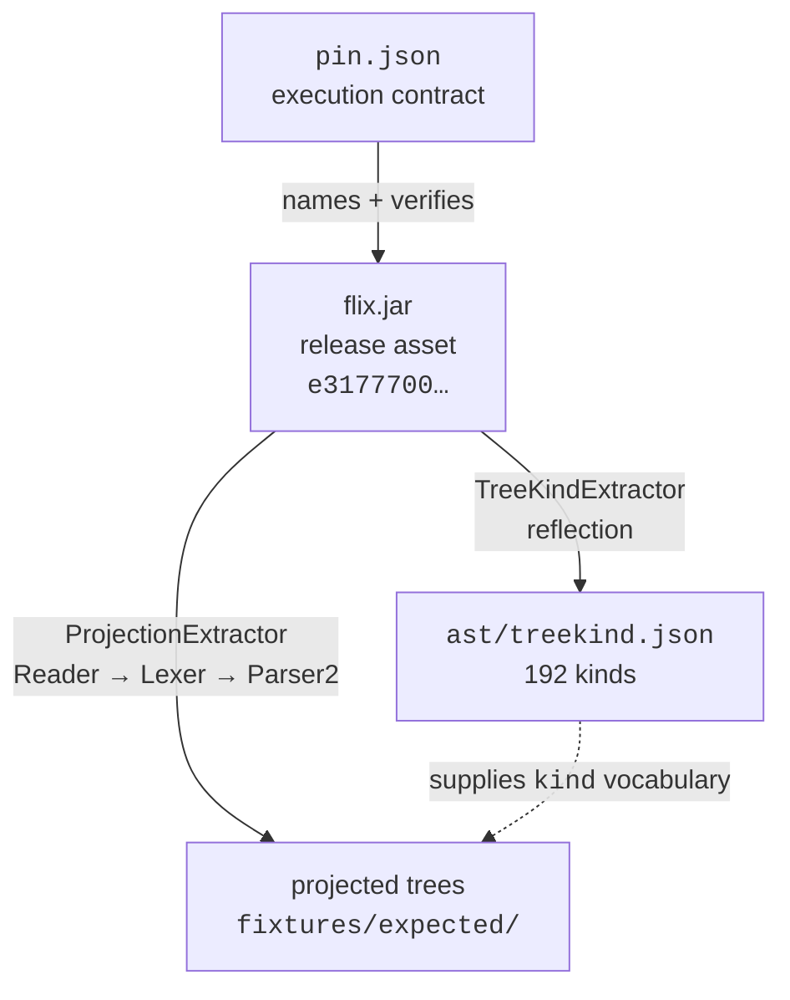

# flix-spec

[](https://github.com/wstein/flix-spec/actions/workflows/verify.yml)
[](https://github.com/wstein/flix-spec/actions/workflows/corpus.yml)
[](pin.json)
[](ast/treekind.json)
[](docs/VERSIONING.md)
[](LICENSE.md)

Every badge above except license reads a live file (`pin.json`, `ast/treekind.json`, the published
`maven-metadata.xml`) rather than a hardcoded number, on purpose — the same reason nothing else in
this repository asserts a fact it can't re-derive. The `maven` badge goes red until the Pages
package is actually published (see "Consuming as a Maven package" below); that's accurate, not
broken.

Shared test infrastructure for parsers of [Flix](https://github.com/flix/flix): a machine-readable
inventory of the language's syntax tree kinds, a corpus definition pinned to an upstream release,
and fixtures with expected tree shapes — all derived from the reference compiler at a pinned
release, and used by independent parser implementations to check that they agree with it.

**What this is not:** a specification of Flix, and not a conformance suite in the Test262 sense.
Test262 derives from ECMA-262, a normative document independent of every implementation; this
derives from the reference implementation itself. It has no independent authority over the
language and does not claim any.

**The accepted limitation, stated up front:** a derived suite cannot falsify the reference
compiler. If Flix has a bug, `flix-spec` inherits it and reports every agreeing parser as correct.
That is a deliberate trade — it buys an oracle that cannot drift.

Design rationale lives in [`docs/PROJECTION.md`](docs/PROJECTION.md) (what conformance means),
[`docs/phase0-spike.md`](docs/phase0-spike.md) (why the oracle is a pinned release jar rather than
a rebuild), and [`docs/PIN-BUMP.md`](docs/PIN-BUMP.md) (how the pin moves).

## Status

**Phase 1 (pin, contracts, AST inventory, corpus) and Phase 2 (projected fixtures, coverage, reachability) complete.**

Key components established:
- **Oracle pin contract ([`pin.json`](pin.json))**: pinned to upstream release `v0.75.1` (`318bb51a…`, tree `294b9ac53…`), the release asset's SHA-256 (`e3177700…`), the entry point actually used, the required library level, and the classpath requirement. The `attestation` field records that the jar is **attested by digest, not by provenance** — upstream publishes no release workflow, no build attestation, and no commit stamp inside the artifact.
- **Projection contract ([`docs/PROJECTION.md`](docs/PROJECTION.md))**: canonical projected tree format, load-bearing versus advisory elements, normalisation rules, and consumer projection maps.
- **JSON schemas ([`schemas/`](schemas/))**: draft-07 definitions for `ast/treekind.json` and canonical projected trees, enforced in CI by [`TreeKindSchemaValidator`](tools/project/src/main/scala/flix/spec/TreeKindSchemaValidator.scala).
- **Committed AST inventory ([`ast/treekind.json`](ast/treekind.json))**: 192 `TreeKind` nodes with qualified names, parent traits and forms, name-set digest `ef4c5a85…`, and a provenance header naming the generator, tool version, upstream commit and the exact oracle jar it was derived from.
- **Token inventory ([`ast/tokenkind.json`](ast/tokenkind.json))**: 160 `TokenKind`s (159 case objects plus `Err`), digest-pinned in `pin.json`. This is the contract for **lexical** consumers such as `flix-textmate`, which have no parse tree and cannot consume `fixtures/expected/`. Every `token` in a projected tree is validated against it — previously the projection schema declared `token` as an unconstrained string, so 134 distinct names were committed and checked against nothing. **159 of 160 are now exercised by fixtures** — the lexical counterpart of tree-kind coverage, closed the same way: measured, then fixed. `Eof` is the one exception, and it is structurally rather than incidentally uncovered: the lexer always appends it as a virtual sentinel, but the parser only ever tests `at(TokenKind.Eof)` to decide when to stop — it is never pushed onto the tree as a node's child, so no fixture, however constructed, can make it appear in a projected tree.
- **Corpus definition ([`corpus/`](corpus/))**: 873 pinned `.flix` files (688 under `main/`, 185 under `examples/`), inclusion rules, and a tree-hash-verified fetch script.
- **Projected fixtures ([`fixtures/`](fixtures/))**: 134 fixtures — 113 positive, 21 negative — with expected trees generated from the pinned oracle and held under a diff gate. Kind names are sub-trait qualified, sources are repository-relative, and diagnostics record `kind`/`line` as gated with `col`/`message` advisory. **23 of the 24 diagnostic kinds `Reader`/`Lexer`/`Parser2` can actually produce are now exercised** — 15 of 15 `LexerError` variants and 8 of 9 `Parser2`-raised `ParseError` variants. The ninth, `MisplacedComments`, is not just unreproduced but **unreachable by construction**: `expect()` calls `open()`, which unconditionally consumes any leading comment before `expect()` ever inspects it, so the match arm mapping a comment to `MisplacedComments` can never fire — see `docs/CONFORMANCE.md` for the full trace. Three further `ParseError` variants (`MissingRegion`, `NeedAtleastOne`, `MissingBinaryOperator`) are raised only by `Weeder2`, a phase this repository's pipeline never runs, and are excluded from that count as structurally out of scope rather than silently missing.
- **Coverage ([`ast/coverage.json`](ast/coverage.json))**: 184 of 192 kinds exercised by fixtures — measured, not claimed.
- **Reachability ([`ast/reachability.json`](ast/reachability.json))**: 184 of 192 kinds actually emitted by the reference across all 873 corpus files. Coverage equals reachability, so **every kind the reference is known to produce is exercised by a fixture**. The 8 remaining kinds are never emitted anywhere in the corpus at this pin.
- **Conformance checking ([`docs/CONFORMANCE.md`](docs/CONFORMANCE.md))**: consumers emit canonical projected trees; [`Conformance`](tools/project/src/main/scala/flix/spec/Conformance.scala) does the comparison once, here, rather than four times across four repositories. Projection maps live in [`ast/projection/`](ast/projection/) and declare vocabulary plus wrapper transparency.
- **CI and verification**: actions pinned by commit SHA, runner pinned to `ubuntu-24.04`, and Dependabot for actions and Gradle.

  | Workflow | Trigger | Does |
  | --- | --- | --- |
  | [`oracle.yml`](.github/workflows/oracle.yml) | `pin.json` changes, manual | Fetch the pinned jar, verify its SHA-256, cache it by digest |
  | [`verify.yml`](.github/workflows/verify.yml) | push, PR | Format check, tests, end-to-end suite, regenerate and diff `ast/treekind.json` |
  | [`corpus.yml`](.github/workflows/corpus.yml) | weekly, manual | Clone upstream, verify tree hash and counts, regenerate reachability; report if the pin is behind |
  | [`release.yml`](.github/workflows/release.yml) | `v*` tag | Verify, then publish the artifact bundle with `SHA256SUMS` |
  | [`pages.yml`](.github/workflows/pages.yml) | push to `main`, `v*` tag | Verify, then publish the Maven package (see "Consuming as a Maven package" below) |

### How the pieces fit



Nothing is generated from a jar whose digest has not first been checked against `pin.json`.

## Layout

```text
pin.json                 # Oracle execution contract & artifact SHA-256 digests
NOTICE.md                # Third-party provenance and attribution
docs/
  PROJECTION.md          # Projection specification & conformance contract
  PIN-BUMP.md            # Step-by-step checklist for pinning new releases
  phase0-spike.md        # Feasibility spike findings and decision record
  VERSIONING.md          # Maven package versioning scheme and rationale
schemas/
  treekind.schema.json      # JSON Schema for ast/treekind.json
  tokenkind.schema.json     # JSON Schema for ast/tokenkind.json
  projection.schema.json    # JSON Schema for canonical projected trees
  projection-map.schema.json # JSON Schema for consumer projection maps
ast/
  projection/            # Consumer vocabulary maps (tree-sitter-flix, ...)
  treekind.json          # GENERATED — 192 qualified syntax tree kinds, digest, provenance header
  tokenkind.json         # GENERATED — 160 lexical token kinds, digest, provenance header
  coverage.json          # GENERATED — which kinds the fixture suite exercises
  reachability.json      # GENERATED — which kinds the reference emits across the whole corpus
corpus/
  corpus.json            # Pinned corpus inventory specification & inclusion rules
  fetch                  # Clone, check out, and verify the corpus tree hash
fixtures/
  positive/              # Sources the reference parses cleanly
  negative/              # Sources the reference rejects or recovers from
  expected/              # GENERATED — canonical projected trees
tools/
  oracle/                # fetch.sh (pinned jar + checksum), build-from-source.sh (fallback)
  project/               # Gradle + Scala module: extractors, validators, conformance, tests
    src/main/scala/flix/spec/
      TreeKindSchemaValidator.scala  # Validates ast/treekind.json against its schema
      ProjectionSchemaValidator.scala # Schema + kind-vocabulary validation of fixtures/expected/
      ProjectionMapValidator.scala   # Validates ast/projection/*.json
      Coverage.scala                 # Generates ast/coverage.json
      Conformance.scala              # Compares a consumer's projected trees against fixtures/expected/
    verify.sh            # End-to-end verification suite
packaging/               # Gradle module: packages pin.json/ast/schemas/fixtures/corpus.json
                          # into the io.github.wstein:flix-spec Maven artifact
```

## Consuming as a Maven package

Everything in `ast/`, `schemas/`, `fixtures/` and `corpus/corpus.json`, plus `pin.json`, is also
published as `io.github.wstein:flix-spec` — for a consumer that would rather add a dependency than
vendor files by hand. Versioning is documented in [`docs/VERSIONING.md`](docs/VERSIONING.md); in
short it is plain semver, `<flixMajor>.<flixMinor>.<revision>` — currently `0.75.1`, derived from
Flix v0.75.1.

The pin is deliberately **not** encoded in the version. A version can advertise a pin but never
enforce one, and this project has already seen a consumer depend on fixtures from one Flix while
testing against a checkout of another — a mismatch no naming convention detects. Enforcement is a
comparison the consumer makes against `pin.json`, which ships inside the artifact. Advertisement is
handled three ways that do not distort ordering: the `FLIX-PIN-<tag>` marker file, the POM's
`flix.tag`/`flix.commit`/`flix.treeHash`/`flix.oracleSha256` properties, and `pin.json` itself.

Published to two places, with a real trade-off between them:

| | GitHub Pages (`maven/` on the `gh-pages` branch) | GitHub Packages (`maven.pkg.github.com`) |
| --- | --- | --- |
| URL | `https://wstein.github.io/flix-spec/maven/` | `https://maven.pkg.github.com/wstein/flix-spec` |
| Read access | Public, anonymous — plain static files | **Requires authentication even for public repositories** — a GitHub Packages limitation, not a choice made here |
| Retention | Every published version accumulates in git history on `gh-pages`, forever, by construction | Managed by GitHub; versions are not deleted by this repository |

For a consumer who cannot or would rather not manage a GitHub token just to resolve a dependency,
the Pages repository is the one to use:

```kotlin
repositories {
    maven { url = uri("https://wstein.github.io/flix-spec/maven/") }
}

dependencies {
    implementation("io.github.wstein:flix-spec:0.75.1")
}
```

The GitHub Packages coordinate is identical; only the repository declaration changes, and it
additionally needs `credentials { username = ...; password = /* a token with read:packages */ }`.

## Running verification and generators

```sh
./tools/oracle/fetch.sh                                    # Fetch and verify the pinned oracle jar
./corpus/fetch                                             # Fetch and verify the pinned source corpus
./gradlew :tools:project:generateTreeKind                  # Regenerate ast/treekind.json (asserts against pin.json)
./gradlew :tools:project:proposeTreeKind                   # Report count + digest without asserting (pin bumps)
./gradlew :tools:project:generateTokenKind                 # Regenerate ast/tokenkind.json (asserts against pin.json)
./gradlew :tools:project:proposeTokenKind                  # Report token count + digest without asserting
./gradlew :tools:project:extract --args=path/to/file.flix  # Emit a projected concrete syntax tree
./gradlew :tools:project:generateFixtures                  # Regenerate fixtures/expected/*.json
./gradlew :tools:project:reachability                      # Regenerate ast/reachability.json (needs ./corpus/fetch)
./gradlew :tools:project:generateCoverage                  # Regenerate ast/coverage.json
./gradlew :tools:project:conformance --args='--actual <dir>' # Check a consumer against the fixtures
./gradlew test                                             # ScalaTest suite
./tools/project/verify.sh                                  # End-to-end verification suite
./gradlew spotlessApply                                    # Format Scala, scripts, workflows, JSON
```

`generateTreeKind` asserts its output against `pin.json` and refuses to run if they disagree. That
is intentional: a pin bump must update `pin.json` in the same commit. Use `proposeTreeKind` to
discover the new values first — see [`docs/PIN-BUMP.md`](docs/PIN-BUMP.md).

## License

Apache-2.0, matching `flix/flix`. See [`LICENSE.md`](LICENSE.md) and [`NOTICE.md`](NOTICE.md).
