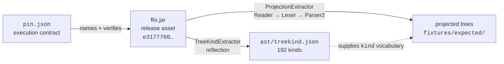

# flix-spec

Shared test infrastructure for parsers of [Flix](https://github.com/flix/flix): a machine-readable
inventory of the language's syntax tree kinds, a corpus definition pinned to an upstream release,
and fixtures with expected tree shapes — all derived from the reference compiler at a pinned
release, and used by independent parser implementations to check that they agree with it.

**What this is not:** a specification of Flix, and not a conformance suite in the Test262 sense.
Test262 derives from ECMA-262, a normative document independent of every implementation; this
derives from the reference implementation itself. It has no independent authority over the
language and does not claim any.

**The accepted limitation, stated up front:** a derived suite cannot falsify the reference
compiler. If Flix has a bug, `flix-spec` inherits it and reports every agreeing parser as correct.
That is a deliberate trade — it buys an oracle that cannot drift.

Design rationale lives in [`docs/PROJECTION.md`](docs/PROJECTION.md) (what conformance means),
[`docs/phase0-spike.md`](docs/phase0-spike.md) (why the oracle is a pinned release jar rather than
a rebuild), and [`docs/PIN-BUMP.md`](docs/PIN-BUMP.md) (how the pin moves).

## Status

**Phase 1 (Pin, contracts, AST inventory & corpus specification) complete.**

Key components established:
- **Oracle pin contract ([`pin.json`](pin.json))**: pinned to upstream release `v0.75.1` (`318bb51a…`, tree `294b9ac53…`), the release asset's SHA-256 (`e3177700…`), the entry point actually used, the required library level, and the classpath requirement. The `attestation` field records that the jar is **attested by digest, not by provenance** — upstream publishes no release workflow, no build attestation, and no commit stamp inside the artifact.
- **Projection contract ([`docs/PROJECTION.md`](docs/PROJECTION.md))**: canonical projected tree format, load-bearing versus advisory elements, normalisation rules, and consumer projection maps.
- **JSON schemas ([`schemas/`](schemas/))**: draft-07 definitions for `ast/treekind.json` and canonical projected trees, enforced in CI by [`tools/project/validate-treekind.py`](tools/project/validate-treekind.py).
- **Committed AST inventory ([`ast/treekind.json`](ast/treekind.json))**: 192 `TreeKind` nodes with qualified names, parent traits and forms, name-set digest `ef4c5a85…`, and a provenance header naming the generator, tool version, upstream commit and the exact oracle jar it was derived from.
- **Corpus definition ([`corpus/`](corpus/))**: 873 pinned `.flix` files (688 under `main/`, 185 under `examples/`), inclusion rules, and a tree-hash-verified fetch script.
- **CI and verification**: fast-tier workflows ([`verify.yml`](.github/workflows/verify.yml), [`oracle.yml`](.github/workflows/oracle.yml)), actions pinned by commit SHA, runner pinned to `ubuntu-24.04`, and Dependabot for actions and Gradle.

### How the pieces fit



Nothing is generated from a jar whose digest has not first been checked against `pin.json`.

## Layout

```text
pin.json                 # Oracle execution contract & artifact SHA-256 digests
NOTICE.md                # Third-party provenance and attribution
docs/
  PROJECTION.md          # Projection specification & conformance contract
  PIN-BUMP.md            # Step-by-step checklist for pinning new releases
  phase0-spike.md        # Feasibility spike findings and decision record
schemas/
  treekind.schema.json   # JSON Schema for ast/treekind.json
  projection.schema.json # JSON Schema for canonical projected trees
ast/
  treekind.json          # GENERATED — 192 qualified syntax tree kinds, digest, provenance header
corpus/
  corpus.json            # Pinned corpus inventory specification & inclusion rules
  fetch                  # Clone, check out, and verify the corpus tree hash
fixtures/                # Test fixtures (positive / negative)
tools/
  oracle/                # fetch.sh (pinned jar + checksum), build-from-source.sh (fallback)
  project/               # Gradle + Scala module: extractors, tests, verification suite
    validate-treekind.py # Structural validation of ast/treekind.json against its schema
    verify.sh            # End-to-end verification suite
```

## Running verification and generators

```sh
./tools/oracle/fetch.sh                                    # Fetch and verify the pinned oracle jar
./corpus/fetch                                             # Fetch and verify the pinned source corpus
./gradlew :tools:project:generateTreeKind                  # Regenerate ast/treekind.json (asserts against pin.json)
./gradlew :tools:project:proposeTreeKind                   # Report count + digest without asserting (pin bumps)
./gradlew :tools:project:extract --args=path/to/file.flix  # Emit a projected concrete syntax tree
./gradlew test                                             # ScalaTest suite
./tools/project/verify.sh                                  # End-to-end verification suite
./gradlew spotlessApply                                    # Format Scala, scripts, workflows, JSON
```

`generateTreeKind` asserts its output against `pin.json` and refuses to run if they disagree. That
is intentional: a pin bump must update `pin.json` in the same commit. Use `proposeTreeKind` to
discover the new values first — see [`docs/PIN-BUMP.md`](docs/PIN-BUMP.md).

## License

Apache-2.0, matching `flix/flix`. See [`LICENSE.md`](LICENSE.md) and [`NOTICE.md`](NOTICE.md).
