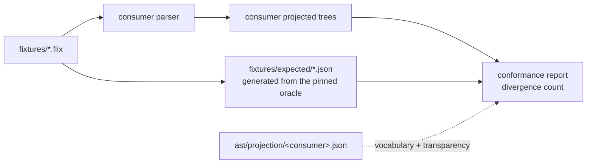

# Conformance checking

How an independent parser checks that it agrees with the Flix reference compiler, using this
repository's fixtures.

## The split

The work divides in two, and the division is the point. Four repositories re-deriving the same
comparison four times is the duplication `flix-spec` exists to end.

| Side | Who | What |
| --- | --- | --- |
| Produce | the consumer | Parse each fixture, emit a canonical projected tree per `schemas/projection.schema.json` |
| Compare | `flix-spec` | `tools/project/conformance.py` diffs those trees against `fixtures/expected/` |



## What is compared

Per [`PROJECTION.md`](PROJECTION.md) section 3:

- **gated**: node kind, child order, nesting;
- **not compared**: spans and tokens. Token vocabularies differ legitimately between parsers and
  spans are advisory, so comparing either would report differences that are not disagreements
  about structure.

## Transparency, and why it is symmetric

Parsers disagree about wrapper nodes far more than about structure. At the current pin **412 of
3572 canonical nodes (11.5%) are single-child wrappers**, `Type.Type` alone accounting for 247. A
parser that was not the reference's parent will not reproduce them, and that is not a defect.

So the projection map declares transparency on both sides:

- `elide` — canonical kinds the consumer does not produce (`Type.Type`, an empty `Doc`, a
  single-child `QName`);
- `ignored` — the consumer's own wrappers with no counterpart in the reference.

A transparent node is **dropped when empty** and **replaced by its child when it has exactly one**.
With two or more children it is *kept*: splicing its children into the parent would discard real
structure and let a genuine disagreement pass as a mapping decision.

Handling only one side is worse than handling neither — the other side's wrapper then faces a real
node and reports as a disagreement. Making elision symmetric took the `tree-sitter-flix` baseline
from 196 divergences to 142; getting empty-node elision right took it from 233 to 196; eliding
single-child `QName` took it from 142 to 83.

## Unmapped is not divergent

A native node that is neither mapped nor ignored is counted as **unmapped**, never as a
divergence. "We have not mapped this yet" is a different fact from "we disagree with the
reference", and collapsing the two would make an incomplete map look like a broken parser.

## Running it

```sh
# Identity: the expectations must agree with themselves.
python3 tools/project/conformance.py --actual fixtures/expected

# A consumer, with its vocabulary map and a ratchet.
python3 tools/project/conformance.py \
    --actual path/to/consumer/output \
    --map ast/projection/tree-sitter-flix.json \
    --report build/conformance.json \
    --baseline 83
```

Exit status is non-zero when divergences exceed `--baseline`, so the ratchet is the gate. Lower the
baseline as divergences are fixed; never raise it without saying why.

## Measured baselines

| Consumer | Fixtures agreeing | Divergences | Nodes compared | Measured against |
| --- | --- | --- | --- | --- |
| `tree-sitter-flix` | 72 / 110 | 83 | 667 | `8875cfb4`, tree-sitter CLI 0.26.11 |

Reproducing this needs the `tree-sitter` CLI and a built grammar, so it is **not** part of CI here;
the consumer repository is the right home for that job. What CI does verify is that the comparison
itself is sound: `fixtures/expected` must agree with itself at zero divergences, and a deliberately
mutated copy must be detected.

Three of the 113 fixtures produced no `tree-sitter-flix` output at all and are excluded from the
110 compared.

## Writing a projection map

Start empty and let the report drive it: every run lists `unmappedNames` in frequency order, so the
next most valuable mapping is always the top of that list. Map what is genuinely the same node;
declare wrappers transparent; leave the rest unmapped rather than guessing, because a wrong mapping
reports as agreement and is worse than a gap.

`mappings` values are validated against `ast/treekind.json`, so a typo or a stale kind name fails
immediately instead of silently never matching.
