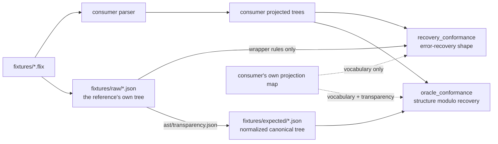

# Conformance checking

How an independent parser checks that it agrees with the Flix reference compiler, using this
repository's fixtures.

## The split

The work divides in two, and the division is the point. Four repositories re-deriving the same
comparison four times is the duplication `flix-spec` exists to end.

| Side | Who | What |
| --- | --- | --- |
| Produce | the consumer | Parse each fixture, emit a projected tree per `schemas/projection.schema.json` at `form: "raw"`, plus a vocabulary map (`mappings`/`ignored`/`flatten`/`recoveryMarkers`) that is itself the consumer's own data, committed in the consumer's repository -- it encodes facts about that grammar's shape, not about the reference |
| Compare | `flix-spec` | [`Conformance`](../tools/project/src/main/scala/flix/spec/Conformance.scala) diffs those trees against `fixtures/expected/` and `fixtures/raw/`, validating `mappings` values against `ast/treekind.json` as it runs |



## What is compared

Per [`PROJECTION.md`](PROJECTION.md) section 3:

- **gated**: node kind, child order, nesting;
- **not compared**: spans and tokens. Token vocabularies differ legitimately between parsers and
  spans are advisory, so comparing either would report differences that are not disagreements
  about structure.

## The three lanes

A conformance report has three lanes, and they are deliberately never summed into one score.

| | `oracle_conformance` | `recovery_conformance` | `source_invariants` |
| --- | --- | --- | --- |
| Measures | structure, *modulo* error recovery | error-recovery shape, and nothing else | the consumer's output against its own input |
| Compares against | `fixtures/expected` — the normalized canonical tree | `fixtures/raw` with the wrapper rules applied and the error vocabulary left standing | nothing; it consults no expected tree |
| Scope | every fixture | only the fixtures whose raw tree contains a recovery marker | every unit the consumer produced |
| Authority | `derived` | `derived` | `independent` |
| Can falsify the reference | no | no | yes |
| Gated by a baseline | `--baseline` | `--recovery-baseline` | no |

The split exists because a single number could not carry the differences. Agreement is measured
against trees the reference produced, so both derived lanes inherit the reference's defects by
construction: a consumer that faithfully reproduces a compiler bug scores as agreeing, and one that
implements the reference's *intent* instead scores as divergent. That is the correct measure of
**compatibility** — consumers should agree with the exact pinned behaviour — and it is not a measure
of correctness. See [`DEFECTS.md`](DEFECTS.md), which the lanes' `caveat` fields name inline.

### Why recovery is its own lane

Two parsers can agree completely about what a valid program means and share nothing whatsoever about
how they resurface from a malformed one. Error recovery is a strategy, not a language feature, and
folding it into a structural score makes that score mean neither thing.

So the error vocabulary — `ErrorTree`, `OperatorError`, `TrailingDot` — is spliced out of
`fixtures/expected` before any consumer sees it, and measured on its own against `fixtures/raw`. The
recovery lane's expectation is **not** the raw tree verbatim: it is the raw tree with the *wrapper*
rules applied and only the error vocabulary left in, so the sole thing it sees that the structural
lane does not is recovery shape. Comparing against raw verbatim was the obvious design and the wrong
one — wrapper divergences the first lane has already accounted for would drown the signal.

**Transparency here has to be symmetric, and that is what a consumer must declare.** One consumer
tree cannot both have and lack recovery markers, so the projection map names which of its own nodes
are markers, in `recoveryMarkers`:

- `oracle_conformance` splices them out of the consumer's side, exactly as normalisation spliced
  `ErrorTree` out of the canonical side. A consumer emitting an `ERROR` node is not penalised for
  information the canonical tree deliberately dropped.
- `recovery_conformance` keeps them on both sides and compares nothing else.

Listing such a node in `flatten` instead would remove it from *both* lanes and its shape would be
measured nowhere; the comparison rejects a node declared as both. A map declaring **no**
`recoveryMarkers` gets a `not-applicable` verdict with that as the recorded reason, rather than a
failure for not modelling recovery at all.

### The independent lane

The third lane consults no expected tree at all. It asks whether the consumer's output is
self-consistent and faithful to the source it was produced from:

| Check | Asks |
| --- | --- |
| `document-shape` | is every unit a well-formed projected document? |
| `kind-vocabulary` | is every node kind one the reference defines? |
| `token-vocabulary` | is every token kind one the reference's lexer defines? |
| `token-accounting` | does concatenating token text reproduce the source? |

**The lanes are genuinely independent, and each interesting case is one lane passing while another
fails.** CI asserts both:

- Blank one token's text in a copy of `fixtures/expected` and `oracle_conformance` still reports
  every fixture agreeing with zero divergences — kinds, child order and nesting are untouched — while
  `token-accounting` fails. A tree can be perfectly well-shaped and have lost its contents, and only
  the lane that ignores the oracle can see that.
- Delete the error markers from one raw tree and `oracle_conformance` stays at zero divergences,
  because normalisation removes those nodes from both sides before it looks, while
  `recovery_conformance` fails. If it did not, the recovery lane would be measuring nothing.

So the third lane gates too, and is **not** subject to any baseline. The ratchets exist because
mapping coverage is approached incrementally, one mapping at a time; losing a token's text is not a
gap a consumer is partway through closing.

### `not-applicable` is a third verdict, and it carries weight

A check that cannot be evaluated says so, with the reason. Spans and tokens are not gated, so a
purely structural adapter that emits no token text is exercising a choice the contract grants it:
failing `token-accounting` would penalise a permitted decision, and passing it would claim a
property nothing established. Neither is true, so neither is reported. The vocabulary checks stand
down the same way when a projection map is in play, since native node names are then exactly what
the map exists to translate rather than a defect to report twice.

This is also what makes the report meaningful to a lexical consumer, which has no tree to compare
and can still pass `token-accounting` on its own merit.

### Provenance

Every report is stamped with `pinTag`, `pinCommit`, `oracleSha256`, `corpusTreeHash`,
`fixtureRevision` and both vocabulary digests. A conformance number without them is not comparable
to any other conformance number — this project has already seen a consumer depend on fixtures from
one Flix release while testing against a checkout of another, a mismatch no naming convention
detects.

`fixtureRevision` is a SHA-256 over the name and content digest of every expectation, so a renamed
fixture moves it as surely as an edited one.

The shape is `schemas/conformance-report.schema.json`, and
`./gradlew :tools:project:validateReport --args='<report.json>'` checks a report against it —
including the relationships a schema cannot express, such as a verdict that does not follow from
its own numbers, or more divergences listed than counted.

## Diagnostic-kind coverage

`Reader`/`Lexer`/`Parser2` can raise 24 distinct diagnostic kinds in this pipeline: 15
`LexerError` variants and 9 `Parser2`-raised `ParseError` variants. (Three more `ParseError`
variants — `MissingRegion`, `NeedAtleastOne`, `MissingBinaryOperator` — are raised only by
`Weeder2`, a phase this pipeline never runs; they are out of scope by construction, not a gap.)
Fixtures now exercise 23 of those 24.

**The 24th, `ParseError.MisplacedComments`, is not merely unreproduced — it is unreachable by
construction**, and the reason is worth recording precisely rather than leaving as "we couldn't
trigger it":

- `expect`/`expectAny`/`expectAnyOpt` each call `open()` before inspecting `nth(0)` to classify a
  failure, and each has a match arm mapping a leading `CommentLine`/`CommentBlock` to
  `MisplacedComments`.
- `open()` unconditionally calls `comments()`, which unconditionally consumes any run of leading
  comments (doc or not) and wraps them in a `CommentList` node, *before returning*.
- So by the time `expect` et al. inspect `nth(0)`, any leading `CommentLine`/`CommentBlock` has
  already been consumed by `open()`'s own call. Those two match arms can never fire: `nth(0)`
  cannot be a plain comment at that point.

`ParseError.MisplacedDocComments`, by contrast, *is* reachable — but not through that same dead
code. It comes from a second, independent check inside `comments()` itself: after consuming a run
of comments, if the last one was a doc comment (`CommentDoc`) and the token now at `nth(0)` is not
`isDocumentable` (cannot start a declaration, nor `case`/`law`), the doc comment is "dangling" and
`comments()` raises `MisplacedDocComments` directly — no `expect()` call involved.
`fixtures/negative/declarations__doc-comment-misplaced-before-paren.flix` exercises exactly this:
a doc comment immediately before `(`, which is not documentable.

## Transparency, and why it is symmetric

Parsers disagree about wrapper nodes far more than about structure. A large fraction of canonical
nodes carry no structure of their own — they wrap exactly one child — and a parser that was not the
reference's parent will not reproduce them. That is not a defect.

The exact figure is **generated**, not written here: `ast/coverage.json` carries `nodeCount`,
`singleChildWrapperNodes` and the per-kind `alwaysSingleChildWrapper` breakdown, regenerated by
`generateCoverage` whenever fixtures change.

<!-- generated: wrappers -->
At this pin that is **483 of 4228 nodes (11.4%)**, across 136 fixtures.
Read [`ast/coverage.json`](../ast/coverage.json) for the per-kind `alwaysSingleChildWrapper`
breakdown; this paragraph is regenerated from it rather than retyped.
<!-- /generated: wrappers -->

An earlier revision of this document hard-coded "412 of 3572". It went stale the moment eight
fixtures were added, and it had an undocumented `>= 5` occurrence threshold baked into the one-off
script that produced it. Both are why the number is generated now.

The revision after *that* quoted a node ratio and then added "but read the artifact, not this
sentence" — and went stale anyway, inside the very sentence telling the reader not to trust it.
Instructing a reader to prefer the artifact does not make a retyped number self-updating. Hence the
block above, which `generateDocs` rewrites and CI diffs. The figures are deliberately not repeated
here, so that this paragraph cannot become the next example of its own subject.

A transparent node is **dropped when empty** and **replaced by its child when it has exactly one**.
With two or more children it is *kept*: splicing its children into the parent would discard real
structure and let a genuine disagreement pass as a mapping decision.

Handling only one side is worse than handling neither — the other side's wrapper then faces a real
node and reports as a disagreement.

### The canonical side is handled upstream now

Transparency used to be declared symmetrically *in every consumer's map*: `elide` for canonical
wrappers and `ignored` for the consumer's own. Half of that was in the wrong repository. Whether
`Type.Type` carries information is a fact about the reference's grammar, and re-deriving it per
consumer meant each consumer's own shape leaked into the answer — with one instrumented consumer,
nothing could have told the difference.

So the canonical half moved to [`ast/transparency.json`](../ast/transparency.json), applied once when
fixtures are generated (see [`PROJECTION.md`](PROJECTION.md) §2.3). `elide` and `flattenCanonical`
are deprecated in the map schema, retained only for consumer-specific extras.

What a consumer still declares, and must:

| Field | Names | Applies to |
| --- | --- | --- |
| `ignored` | its own wrappers, transparent at arity ≤ 1 | its side |
| `flatten` | its own pure grouping nodes, spliced at any arity | its side |
| `recoveryMarkers` | its own error-recovery nodes | its side, in the structural lane only |

### Triangulation: does the contract describe the reference, or one consumer?

This is the design's one structural weakness, and it cannot be argued away — only measured. Every
rule in `ast/transparency.json` is justified from the reference's own source, but the rules were
*written* while looking at one consumer's divergences, and no check inside this repository could
tell a neutral rule from one shaped by that consumer.

So the contract was tested against a second, independently-written map: `flix-jetbrains-plugin`, a
Grammar-Kit grammar whose shape differs from the reference far more than tree-sitter's does — 30% of
its nodes are always single-child wrappers, against 11.4% on the canonical side. Its `elide` list was
written before the contract existed, by someone solving a different problem.

| Contract rule | Independently declared transparent by `flix-jetbrains-plugin` |
| --- | --- |
| `Argument`, `Doc`, `Pattern.Variable`, `Predicate.Body`, `Type.Argument`, `Type.Effect`, `Type.Type` | **yes — 7 of 12, listed explicitly** |
| `Expr.HoleVariable`, `Expr.StructPutRHS`, `Expr.UnsafeAsEffFragment` | not listed, but every fixture containing them **agrees**, so that consumer produces no counterpart either |
| `Expr.DebugInterpolator`, `Predicate.LatticeTerm` | unresolved — those fixtures diverge, for the reason below |

**Then the decisive test: removing the 7 contract-covered entries from that consumer's map changed
nothing.** Not approximately — 117/136 agreeing, 34 divergences, 1250 nodes compared, 93% depth,
1477 nodes elided, and the same 34 individual divergences, before and after, bit for bit. The
entries were matching nothing, because normalisation had already removed what they named. The same
experiment on `tree-sitter-flix` gave the same answer.

That is as close to evidence of neutrality as two consumers can provide. It is not proof: both are
still parsers of the same language written against the same reference, and a rule wrong in a way
*both* would reproduce would survive this. A third consumer of a genuinely different kind — a
lexical one, or a hand-written recursive-descent parser — would tighten it further.

#### What triangulation actually found

Not a bad rule. A defect class nobody had thought to look for.

Both consumers still mapped native nodes **onto canonical kinds the contract removes**. Such a
mapping cannot match — the canonical tree has no such node — so it does not merely do nothing: the
consumer's own node keeps standing where nothing is expected, and the mapping *manufactures*
divergences. On `flix-jetbrains-plugin` seven of them were worth **31 of its 34 divergences**;
removing them took it from 117/136 to **133/136**.

`validateProjectionMap` now rejects it, with the fix named in the message. A mapping onto a *spliced*
kind is the one exception, and only when the native node is declared in `recoveryMarkers` — the
recovery lane keeps those on both sides, which is exactly what makes such a mapping reachable.

**Transparency is one bottom-up fixed point over all of these, not a sequence of passes.** That was
learned the hard way. An earlier revision applied splicing and elision once per level, in sequence,
so a node promoted into a level from below never met the other rule — and the canonical trees contain
exactly that shape, `Type.Type` wrapping an empty `ErrorTree` on a malformed trait signature.
Splicing the marker leaves the wrapper childless and therefore elidable, which a single pass could
not see. The raw trees failed their own comparison at two fixtures because of it. `verify.sh` now
asserts the fixed point by feeding `fixtures/raw` back in as a consumer whose vocabulary happens to
be the canonical one: both derived lanes must reach zero divergences from the same input.

Each rule was added because measurement demanded it, not by design. Against `tree-sitter-flix`:

| Change | Divergences |
| --- | ---: |
| naive kind comparison | 233 |
| elide *empty* wrappers, not just single-child ones | 196 |
| make transparency symmetric (splice, never force a match) | 142 |
| elide single-child `QName` | 80 |

Those four are measured on the 110 fixtures the first adapter could read, at a fixture count long
since superseded; they are kept because the *ordering* is the finding — each rule earned its place
by cutting divergences — not because the absolute numbers still hold.

**This table is the part that genuinely needs a `tree-sitter-flix` run**, unlike the wrapper figure
above, which is intrinsic to the canonical trees and recomputable from `fixtures/expected` alone. It
is therefore stale by construction whenever fixtures are added. See "Measured baselines" below for
the current figures, and re-measure in the consumer repository rather than trusting any row here.

## Lexical consumers

A syntax highlighter or TextMate grammar has no parse tree, so it can never consume
`fixtures/expected/`. Its contract is [`ast/tokenkind.json`](../ast/tokenkind.json) — the 160
`TokenKind`s the reference lexer defines, 159 case objects plus `Err`, reflected from the pinned
jar and pinned by digest in `pin.json`.

That exists so lexical consumers stop scraping `Lexer.scala` as text. Text scraping cannot be
checked against a digest, breaks silently when upstream reformats, and has already produced a
committed lexicon in this ecosystem provenanced to a *fork* rather than to the pin.

`TokenKind` is a flat hierarchy, so unlike `TreeKind` its names need no qualification and cannot
collide.

## Losslessness: the one gate that needs no oracle

Every other check here compares a consumer against expectations derived from the reference, so it
inherits the reference's bugs by construction. Losslessness does not: it compares a tree against
its **input**.

> Concatenating every token's `text`, in order, must reproduce the source file — ignoring
> whitespace and the `$` escape marker, neither of which belongs to any token.

Both exclusions are the lexer's own behaviour, not conveniences. Whitespace is never tokenised.
The `$` in `x.$and(y)` — Flix's escape for a Java method whose name collides with a keyword — is
stepped over explicitly by `Lexer.scala:519-521` ("Don't include the $ sign in the name"), so the
token spans `and` and the `$` belongs to nothing. The rule is deliberately narrow, applying only
when `$` precedes a name character, so string interpolation (`${expr}`) must still round-trip and
a `$` genuinely dropped from a string literal is still caught.

That precision was not designed; it was **measured**. An earlier, broader form of the rule held on
every fixture but failed on 6 cleanly-parsed corpus files — `BigInt.flix`, `Regex.flix`, and four
Java-interop tests — every one of them an escaped Java name. A curated fixture suite could not have
found it; that is what the corpus is for. Narrowing the `$` exclusion to exactly the lexer's own
behaviour is what closed them.

<!-- generated: lossless -->
It now holds on **all 136 fixtures and all 870
cleanly-parsed corpus files** — 870 of the 873 corpus files parse without error, and the
remainder are excluded rather than failing (see below).
<!-- /generated: lossless -->

It catches what a structural comparison cannot: dropped tokens, duplicated tokens, and tokens whose
recorded text does not match the source. A tree can be perfectly well-shaped and still have lost a
token's contents.

Two things it is **not**. It is not byte-exact round-tripping: whitespace and the `$` escape marker
are normalised away before comparison, so this is a token-accounting invariant rather than a proof
of source preservation. And it is not a claim about *meaning* — a tree can account for every token
and still be shaped wrongly. It is a strong, cheap, oracle-free check, and precisely that.

Losslessness is only asserted for files the parser accepted. Error recovery may legitimately
discard text it could not attach, so a lossy *invalid* file is not a finding; a lossy *valid* one
is, and fails the run.

It needs no projection map and no vocabulary agreement, so it is the one gate a purely lexical
consumer can pass today. `./gradlew :tools:project:lossless`.

## Token reachability

`ReachabilityRun` measures the lexical vocabulary over the same corpus walk: **153 of 160
TokenKinds** are emitted somewhere in the 873 files.

Six of the seven that are not — `Bang`, `Caret`, `Dollar`, `Err`, `KeywordSealed`,
`KeywordStaticLowercase` — *are* exercised by hand-written fixtures. That is the clearest
justification for curating a fixture suite at all: 873 files of real Flix do not reach them, and
targeted inputs do.

The seventh, `Eof`, is exercised nowhere, and is **unattachable by construction**. `advance()` is
the only path that attaches a token to a tree, and it returns before doing so when at end of input:

```scala
private def advance()(implicit s: State): Unit = {
  if (eof()) { return }
  s.events.append(Event.Advance)   // never reached for Eof
```

So `Eof` cannot appear in any tree from any input. It is a sentinel, not a gap.

## Unmapped is not divergent

A native node that is neither mapped nor ignored is counted as **unmapped**, never as a
divergence. "We have not mapped this yet" is a different fact from "we disagree with the
reference", and collapsing the two would make an incomplete map look like a broken parser.

## Running it

```sh
# Identity: the expectations must agree with themselves.
./gradlew :tools:project:conformance --args="--actual fixtures/expected"

# A consumer, with its vocabulary map and both ratchets. The map is the consumer's own data, not
# flix-spec's -- see "The split" above -- so it is a path into the consumer's checkout, not this
# repository.
./gradlew :tools:project:conformance --args="\
    --actual path/to/consumer/output \
    --map path/to/consumer/conformance/projection-map.json \
    --report build/conformance.json \
    --baseline 61 \
    --recovery-baseline 45"
```

Exit status is non-zero when either derived lane exceeds its own baseline, **or when the
source-invariants lane fails**. Lower a baseline as divergences are fixed; never raise one without
saying why. No baseline applies to the third lane, and the report records the baseline each lane was
gated against so a passing verdict cannot hide the threshold that produced it.

```sh
# Validate a report against the published shape.
./gradlew :tools:project:validateReport --args='build/conformance.json'
```

## Measured baselines

Measured at pin `v0.75.1` (`318bb51a`), fixture revision `4eccee63`, tree-sitter CLI 0.26.11,
`tree-sitter-flix` at `45fd604`. **Reproducible**: `npm run conformance` in that repository, with
`FLIX_SPEC` pointing here, adapts all 136 fixtures and runs this comparison.

| Consumer | Lane | Verdict | Detail |
| --- | --- | --- | --- |
| `tree-sitter-flix` | `oracle_conformance` | **pass** (baseline 61) | 103 / 136 fixtures agree · 61 divergences · 1923 nodes compared · **99% depth** · 12 unmapped |
| `tree-sitter-flix` | `recovery_conformance` | **fail** (baseline 45) | 5 / 21 in-scope fixtures agree · 45 divergences · 182 nodes compared · **100% depth** |
| `tree-sitter-flix` | `source_invariants` | **pass** (1 of 4 checks evaluated) | `document-shape` pass · the other three `not-applicable` |
| `flix-jetbrains-plugin` | `oracle_conformance` | — | 133 / 136 fixtures agree · 3 divergences · 1258 nodes compared · **93% depth** · 89 unmapped |
| `flix-jetbrains-plugin` | `recovery_conformance` | — | 19 / 21 in-scope fixtures agree · 5 divergences · **94% depth** |
| `flix-jetbrains-plugin` | `source_invariants` | **pass** (1 of 4 checks evaluated) | `document-shape` pass · the other three `not-applicable` |

The two consumers are worth reading against each other rather than separately. `tree-sitter-flix`
reaches 99% depth and 103/136; `flix-jetbrains-plugin` reaches 133/136 at 93% depth. Neither is
simply "better" — the first compares more of each tree and therefore finds more to disagree about,
which is the trade the depth column exists to make visible. Their recovery lanes separate them much
more sharply than their structural ones do: 5/21 against 19/21.

### What splitting the lanes cost, and what it did not

Moving the canonical transparency rules upstream is only defensible if it is **score-neutral where
it must be**, and that was measured against the same grammar and the same CLI, before and after:

| | structural agreement | structural divergences | depth | recovery |
| --- | ---: | ---: | ---: | ---: |
| before | 102 / 136 | 67 | 99% | not measured |
| after | 103 / 136 | 61 | 99% | 5 / 21, 45 divergences |

Broken down by fixture polarity, which is the only breakdown that settles it:

- **Positive fixtures: identical.** The same 21 diverge. None started, none stopped, and depth did
  not move. Ten `elide` entries were deleted from the consumer's map and the structural measurement
  did not notice — which is the claim that had to hold.
- **Negative fixtures: the recovery signal relocated.** Six structural divergences became recovery
  divergences, and `types__effect-annotation-wrong-slash` stopped diverging structurally altogether
  because its disagreement was purely about recovery shape.

Asserting neutrality over all 136 would have been the wrong test and would have masked a real
result. Negative fixtures were *supposed* to move; that is what the split is for.

The 45 recovery divergences are not a regression either. They are signal that used to be averaged
into one number: `tree-sitter-flix`'s `ERROR` node lands in different places than the reference's
`ErrorTree`, and its `unterminated_literal`/`unterminated_string` are named nodes where the reference
emits only an `Err` token. Both are real modelling differences, and a lane that surfaces them is
worth more than a score that absorbed them.

Read the `source_invariants` row carefully, because it is the one most easily overstated. The lane
passes on the strength of a *single* applicable check. `kind-vocabulary` and `token-vocabulary` stand down because
a projection map is in play, so native names are what the map exists to translate; `token-accounting`
stands down because the adapter emits no token text. That is not a criticism of the grammar — it is
an accurate statement that this consumer exercises a **structural** profile, and that the strongest
oracle-free check in the suite has nothing to bite on. `checksEvaluated` exists in the report
precisely so "passes `source_invariants`" cannot be quoted without it.

Agreement moved 77 → 122 across five stages, and then **deliberately back to 103** — the single most
important number in this table is still the one that went down.

### Agreement and depth trade against each other

An unmapped node is skipped, not compared. So a map that maps little compares little and agrees with
almost everything, which is why the report carries depth alongside the count. Completing
`tree-sitter-flix`'s mapping set made that concrete and monotonic:

| mappings added | fixtures agreeing | divergences | depth |
| ---: | ---: | ---: | ---: |
| baseline | 122 / 136 | 31 | 84% |
| +6 | 116 / 136 | 44 | 86% |
| +23 | 113 / 136 | 49 | 88% |
| +71 | 107 / 136 | 58 | 90% |
| + derivation to a fixed point | 90 / 136 | 91 | 94% |
| + the five dominant ambiguous names | 88 / 136 | 102 | 98% |
| + seven positional grammar splits | 87 / 136 | 104 | **99%** |

Every mapping added lowers the headline, because each one exposes a subtree that was previously
never looked at. The divergences were always there. **A consumer reporting 136/136 at 84% depth
would be making a weaker claim than one reporting 107/136 at 90%**, and nothing but the depth figure
distinguishes them — which is the whole reason both are in the report and why the baseline file
records them as a pair.

The mappings themselves were derived rather than guessed: each consumer node was aligned against the
canonical tree position by position, and only names landing on exactly one canonical kind everywhere
they occurred were taken. Ambiguous ones were left unmapped — `integer` sits under `Expr.Literal`,
`ErrorTree` and `Expr.Paren` in different positions, and a projection map keyed on node name cannot
express that.

### How the earlier gains were made

| Grammar change | Why | Effect |
| --- | --- | --- |
| operators become `operator` nodes | the reference wraps every operator in `TreeKind.Operator`; an anonymous token gave `Expr.Binary` two children where it has three | 98 → 103 |
| `type_variable` becomes a leaf | `Type.Variable` holds its name as a token, not a child node | 103 → 107 |
| type-level operators too | `Type.Binary`/`Type.Unary` carry an `Operator` exactly as their expression counterparts do | (same pass) |
| `unterminated_literal`, `trailing_dot` | the reference's Lexer emits an error token and `Parser2` keeps the enclosing declaration rather than discarding it | 107 → 111 |
| `unterminated_string` (external scanner) | same, for a string with no closing quote | 111 → 112 |

The operator case is the one worth remembering, because a projection map could not have fixed it and
trying made things worse. `x +++ y` is an operator and `def +++` is a definition name, which the
reference calls `Ident`; a map entry is per node name with no context, so mapping `generic_operator`
to `Operator` regressed the score. Tree-sitter's `alias()` applies per position, which is what
carries the distinction into the tree.

What remains is 61 structural divergences at **99% depth** with 12 unmapped nodes, plus 45 recovery
divergences over the 21 in-scope fixtures. The projection map is finished: every name that can be
mapped is mapped, and the seven that meant different things in different positions were split in the
grammar instead, because a map keyed on node name cannot express position. Three ambiguous names
survive (`aliased_name`, `argument`, `literal_pattern`) and need the same treatment.

At this depth the agreement count is almost entirely a function of real disagreement rather than of
what is being skipped, which is the state the number needed to be in before it was worth optimising.
Every remaining divergence is two trees genuinely differing.

**`OperatorError` was attempted and abandoned, with evidence.** The reference inserts it as a
synthetic zero-width node for `1 2`, and an external scanner *can* emit a zero-width token — that
part of the earlier "impossible" claim was wrong. But putting it in the operator slot makes
"expression followed by expression" a valid parse, which collides with every rule that ends in an
expression; `tree-sitter generate` rejects it against `open_variant_as` first and there are many
more behind it. Resolving that would mean declaring juxtaposition ambiguous grammar-wide to recover
two divergences. Not worth it, and now demonstrated rather than assumed.

Reproducing this needs the `tree-sitter` CLI and a built grammar, so it is **not** part of CI here;
the consumer repository is the right home for that job. What CI does verify is that the comparison
itself is sound, on four counts:

- `fixtures/expected` agrees with itself at zero divergences;
- a deliberately mutated copy is detected;
- `fixtures/raw`, handed back in as a consumer declaring the canonical transparency rules on its own
  side, reaches zero divergences in **both** derived lanes — the assertion that symmetric
  transparency composes exactly, and the one that caught the fixed-point defect;
- deleting the error markers from one raw tree leaves the structural lane at zero and fails the
  recovery lane, so the split is demonstrably load-bearing rather than decorative.

All fixtures are compared, including the negative ones.

An earlier baseline reported 110 and blamed the grammar for three missing outputs. That was wrong,
and the way it was wrong is worth recording: when a parse contains an `ERROR` node, the
`tree-sitter` CLI appends a plain-text timing line *after* `</sources>`, which is not XML and
breaks a strict parser. The three affected files were exactly the three negative fixtures — the
only ones that produce an `ERROR`. Nothing was wrong with the grammar; the adapter had to truncate
at the closing tag. A consumer-side adapter that silently drops the inputs it cannot read will
always flatter its own parser, so count what was skipped and why. The current measurement adapts
136 of 136 fixtures with zero skips, and reports its skip count either way.

### On the adapter

Converting `tree-sitter parse --xml` output into `--actual`'s shape still takes a script that lives
in neither repository. Only *named* nodes become tree nodes — anonymous tokens are bare text between
elements, and the comparison drops token leaves anyway — so the conversion is small. It is
deliberately not written to synthesise token leaves: this adapter has no Flix tokenization, so
inventing `text` would make `token-accounting` evaluate a fiction rather than stand down honestly.

That script now lives in `tree-sitter-flix` as `scripts/flix-spec-conformance.mjs`, which is the
right home: that repository owns the grammar, the projection map and the CLI dependency, none of
which belong here. `npm run conformance` with `FLIX_SPEC` pointing at a checkout of this repository
re-derives every number in the table above from a clean checkout, and gates on both ratchets in
`conformance/baseline.json`. It is still a measurement someone runs rather than one this
repository's CI maintains — the CLI dependency is why.

## Precedence chains

`flix-jetbrains-plugin` is a Grammar-Kit grammar, and its shape differs from the reference far more
than tree-sitter's does. Every expression descends through roughly seventeen precedence levels --
`LAZY_FORCE_EXPR`, `NOT_EXPR`, `SIGN_EXPR`, `ADDITIVE_EXPR`, … -- each of which is a pass-through
when its operator is absent. **30% of its nodes are always single-child wrappers**, against 11.4%
on the canonical side.

This is why a node may appear in both `ignored` and `mappings`. `ADDITIVE_EXPR` is transparent on
every expression without a `+` and a real `Expr.Binary` when one is present; elision fires only at
arity ≤ 1, so the two entries describe different positions rather than contradicting each other.
An earlier validator rejected the overlap, and this consumer is what proved the rule wrong.

## Writing a projection map

Start empty and let the report drive it: every run lists `unmapped` in frequency order with counts, so the
next most valuable mapping is always the top of that list. Map what is genuinely the same node;
declare your own wrappers transparent in `ignored`; declare your own error nodes in
`recoveryMarkers`; leave the rest unmapped rather than guessing, because a wrong mapping reports as
agreement and is worse than a gap.

Do **not** add `elide` or `flattenCanonical` entries for canonical wrappers. They are deprecated:
`fixtures/expected` already has those nodes removed, so an entry naming one is dead weight, and an
entry naming a canonical kind that is *not* transparent in the reference is a claim about the
reference that belongs in `ast/transparency.json` with an argument behind it — not in a consumer's
map, where nothing can check it.

`mappings` values are validated against `ast/treekind.json`, so a typo or a stale kind name fails
immediately instead of silently never matching. `validateProjectionMap` also rejects a node declared
both a recovery marker and flattened, because its shape would then be measured in neither lane.
