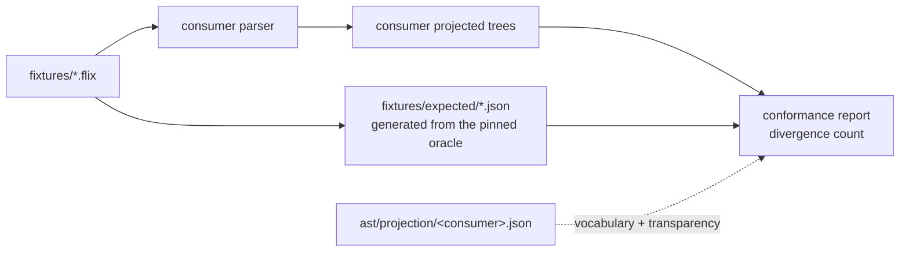

# Conformance checking

How an independent parser checks that it agrees with the Flix reference compiler, using this
repository's fixtures.

## The split

The work divides in two, and the division is the point. Four repositories re-deriving the same
comparison four times is the duplication `flix-spec` exists to end.

| Side | Who | What |
| --- | --- | --- |
| Produce | the consumer | Parse each fixture, emit a canonical projected tree per `schemas/projection.schema.json` |
| Compare | `flix-spec` | [`Conformance`](../tools/project/src/main/scala/flix/spec/Conformance.scala) diffs those trees against `fixtures/expected/` |



## What is compared

Per [`PROJECTION.md`](PROJECTION.md) section 3:

- **gated**: node kind, child order, nesting;
- **not compared**: spans and tokens. Token vocabularies differ legitimately between parsers and
  spans are advisory, so comparing either would report differences that are not disagreements
  about structure.

## Diagnostic-kind coverage

`Reader`/`Lexer`/`Parser2` can raise 24 distinct diagnostic kinds in this pipeline: 15
`LexerError` variants and 9 `Parser2`-raised `ParseError` variants. (Three more `ParseError`
variants — `MissingRegion`, `NeedAtleastOne`, `MissingBinaryOperator` — are raised only by
`Weeder2`, a phase this pipeline never runs; they are out of scope by construction, not a gap.)
Fixtures now exercise 23 of those 24.

**The 24th, `ParseError.MisplacedComments`, is not merely unreproduced — it is unreachable by
construction**, and the reason is worth recording precisely rather than leaving as "we couldn't
trigger it":

- `expect`/`expectAny`/`expectAnyOpt` each call `open()` before inspecting `nth(0)` to classify a
  failure, and each has a match arm mapping a leading `CommentLine`/`CommentBlock` to
  `MisplacedComments`.
- `open()` unconditionally calls `comments()`, which unconditionally consumes any run of leading
  comments (doc or not) and wraps them in a `CommentList` node, *before returning*.
- So by the time `expect` et al. inspect `nth(0)`, any leading `CommentLine`/`CommentBlock` has
  already been consumed by `open()`'s own call. Those two match arms can never fire: `nth(0)`
  cannot be a plain comment at that point.

`ParseError.MisplacedDocComments`, by contrast, *is* reachable — but not through that same dead
code. It comes from a second, independent check inside `comments()` itself: after consuming a run
of comments, if the last one was a doc comment (`CommentDoc`) and the token now at `nth(0)` is not
`isDocumentable` (cannot start a declaration, nor `case`/`law`), the doc comment is "dangling" and
`comments()` raises `MisplacedDocComments` directly — no `expect()` call involved.
`fixtures/negative/declarations__doc-comment-misplaced-before-paren.flix` exercises exactly this:
a doc comment immediately before `(`, which is not documentable.

## Transparency, and why it is symmetric

Parsers disagree about wrapper nodes far more than about structure. A large fraction of canonical
nodes carry no structure of their own — they wrap exactly one child — and a parser that was not the
reference's parent will not reproduce them. That is not a defect.

The exact figure is **generated**, not written here: `ast/coverage.json` carries `nodeCount`,
`singleChildWrapperNodes` and the per-kind `alwaysSingleChildWrapper` breakdown, regenerated by
`generateCoverage` whenever fixtures change. At the time of writing that is 476 of 4181 nodes
(11.4%), with `Type.Type` alone accounting for 289 — but read the artifact, not this sentence.

An earlier revision of this document hard-coded "412 of 3572". It went stale the moment eight
fixtures were added, and it had an undocumented `>= 5` occurrence threshold baked into the one-off
script that produced it. Both are why the number is generated now.

So the projection map declares transparency on both sides:

- `elide` — canonical kinds the consumer does not produce (`Type.Type`, an empty `Doc`, a
  single-child `QName`);
- `ignored` — the consumer's own wrappers with no counterpart in the reference.

A transparent node is **dropped when empty** and **replaced by its child when it has exactly one**.
With two or more children it is *kept*: splicing its children into the parent would discard real
structure and let a genuine disagreement pass as a mapping decision.

Handling only one side is worse than handling neither — the other side's wrapper then faces a real
node and reports as a disagreement.

Each rule was added because measurement demanded it, not by design. Against `tree-sitter-flix`:

| Change | Divergences |
| --- | ---: |
| naive kind comparison | 233 |
| elide *empty* wrappers, not just single-child ones | 196 |
| make transparency symmetric (splice, never force a match) | 142 |
| elide single-child `QName` | 80 |

Those four are measured on the 110 fixtures the first adapter could read; the baseline below covers
all 121.

**This table is the part that genuinely needs a `tree-sitter-flix` run**, unlike the wrapper figure
above, which is intrinsic to the canonical trees and recomputable from `fixtures/expected` alone. It
is therefore stale by construction whenever fixtures are added — adding eight moved it from 74/113
with 85 divergences to 75/121 with 109. Re-measure it in the consumer repository rather than
trusting the row.

## Lexical consumers

A syntax highlighter or TextMate grammar has no parse tree, so it can never consume
`fixtures/expected/`. Its contract is [`ast/tokenkind.json`](../ast/tokenkind.json) — the 160
`TokenKind`s the reference lexer defines, 159 case objects plus `Err`, reflected from the pinned
jar and pinned by digest in `pin.json`.

That exists so lexical consumers stop scraping `Lexer.scala` as text. Text scraping cannot be
checked against a digest, breaks silently when upstream reformats, and has already produced a
committed lexicon in this ecosystem provenanced to a *fork* rather than to the pin.

`TokenKind` is a flat hierarchy, so unlike `TreeKind` its names need no qualification and cannot
collide.

## Losslessness: the one gate that needs no oracle

Every other check here compares a consumer against expectations derived from the reference, so it
inherits the reference's bugs by construction. Losslessness does not: it compares a tree against
its **input**.

> Concatenating every token's `text`, in order, must reproduce the source file — ignoring
> whitespace, which Flix does not emit as tokens.

It holds on every fixture, and it catches what a structural comparison cannot: dropped tokens,
duplicated tokens, and tokens whose recorded text does not match the source. A tree can be
perfectly well-shaped and still have lost a token's contents.

It needs no projection map and no vocabulary agreement, so it is the one gate a purely lexical
consumer can pass today. `./gradlew :tools:project:lossless`.

## Unmapped is not divergent

A native node that is neither mapped nor ignored is counted as **unmapped**, never as a
divergence. "We have not mapped this yet" is a different fact from "we disagree with the
reference", and collapsing the two would make an incomplete map look like a broken parser.

## Running it

```sh
# Identity: the expectations must agree with themselves.
./gradlew :tools:project:conformance --args="--actual fixtures/expected"

# A consumer, with its vocabulary map and a ratchet.
./gradlew :tools:project:conformance --args="\
    --actual path/to/consumer/output \
    --map ast/projection/tree-sitter-flix.json \
    --report build/conformance.json \
    --baseline 109"
```

Exit status is non-zero when divergences exceed `--baseline`, so the ratchet is the gate. Lower the
baseline as divergences are fixed; never raise it without saying why.

## Measured baselines

| Consumer | Fixtures agreeing | Divergences | Nodes compared | Measured against |
| --- | --- | --- | --- | --- |
| `tree-sitter-flix` | 76 / 134 | 135 | 833 | `8875cfb4`, tree-sitter CLI 0.26.11, 134 fixtures |

Re-measured after the diagnostic-kind negative fixtures grew `fixtures/` from 121 to 134 (113
positive unchanged, negative fixtures 8 to 21) — same `tree-sitter-flix` commit as the prior
baseline, so the change in numbers reflects the fixture growth, not a grammar change. The adapter
that converts `tree-sitter parse`'s s-expression output into `--actual`'s JSON shape is a scratch
script, not committed here or in `tree-sitter-flix`: it only needs `kind`/`children` (spans and
tokens are never compared, so field names, node ranges and the trailing timing line tree-sitter
prints after the tree are all discardable), which is small enough to not yet justify a permanent
home in either repository.

`nodesUnmapped` is 181 (up from an unrecorded prior figure), largely from native node kinds the new
fixtures exercise for the first time (`sealed_declaration`, the `rvadd`/`rvsub`/`rvand`/`rvnot`/
`xor` type-operator productions, `lambda`, `record_expression`, and dozens more) that predate this
baseline having any occasion to hit them. Divergences worth noting rather than silently absorbing
into "add more mappings":

- Several `Ident` vs `QName` kind mismatches: `QName` is in `elide`, but only fires when tree-sitter's
  `qualified_name` has at most one canonical child; where it has two the elision rule (by design)
  declines to fire, and the two trees disagree at that node.
- Several `Type.Effect` vs `Type.Constant`/`Type.Unary`/`Type.Binary`/`Type.EffectSet` mismatches:
  the current map appears to send more native effect-formula node kinds to `Type.Effect` than the
  canonical tree actually produces that shape for.
- The `unterminated-*` negative fixtures diverge in arity or kind at the error site, which is not a
  mapping gap at all — it is two independently-implemented recovery strategies genuinely disagreeing
  about what a truncated input becomes, which is exactly the kind of fact this comparison exists to
  surface.

None of the above have been fixed. Expanding `ast/projection/tree-sitter-flix.json` to resolve the
mapping-driven divergences, and deciding whether the recovery-driven ones belong in
`tree-sitter-flix`'s own `DEFECTS.md`-equivalent, is a follow-up, not done here.

Reproducing this needs the `tree-sitter` CLI and a built grammar, so it is **not** part of CI here;
the consumer repository is the right home for that job. What CI does verify is that the comparison
itself is sound: `fixtures/expected` must agree with itself at zero divergences, and a deliberately
mutated copy must be detected.

All fixtures are compared, including the negative ones.

An earlier baseline reported 110 and blamed the grammar for three missing outputs. That was wrong,
and the way it was wrong is worth recording: when a parse contains an `ERROR` node, the
`tree-sitter` CLI appends a plain-text timing line *after* `</sources>`, which is not XML and
breaks a strict parser. The three affected files were exactly the three negative fixtures — the
only ones that produce an `ERROR`. Nothing was wrong with the grammar; the adapter had to truncate
at the closing tag. A consumer-side adapter that silently drops the inputs it cannot read will
always flatter its own parser, so count what was skipped and why.

## Writing a projection map

Start empty and let the report drive it: every run lists `unmappedNames` in frequency order, so the
next most valuable mapping is always the top of that list. Map what is genuinely the same node;
declare wrappers transparent; leave the rest unmapped rather than guessing, because a wrong mapping
reports as agreement and is worse than a gap.

`mappings` values are validated against `ast/treekind.json`, so a typo or a stale kind name fails
immediately instead of silently never matching.
