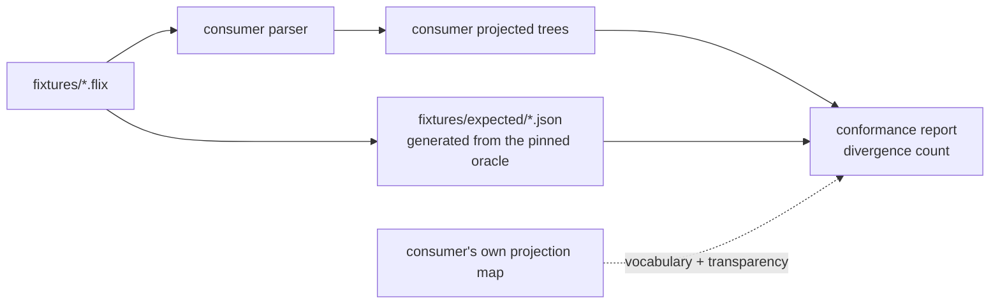

# Conformance checking

How an independent parser checks that it agrees with the Flix reference compiler, using this
repository's fixtures.

## The split

The work divides in two, and the division is the point. Four repositories re-deriving the same
comparison four times is the duplication `flix-spec` exists to end.

| Side | Who | What |
| --- | --- | --- |
| Produce | the consumer | Parse each fixture, emit a canonical projected tree per `schemas/projection.schema.json`, using a vocabulary map (`ignored`/`elide`/`mappings`) that is itself the consumer's own data, committed in the consumer's repository -- it encodes facts about that grammar's shape, not about the reference |
| Compare | `flix-spec` | [`Conformance`](../tools/project/src/main/scala/flix/spec/Conformance.scala) diffs those trees against `fixtures/expected/`, validating `mappings` values against `ast/treekind.json` as it runs |



## What is compared

Per [`PROJECTION.md`](PROJECTION.md) section 3:

- **gated**: node kind, child order, nesting;
- **not compared**: spans and tokens. Token vocabularies differ legitimately between parsers and
  spans are advisory, so comparing either would report differences that are not disagreements
  about structure.

## The two lanes

A conformance report has two lanes, and they are deliberately never summed into one score.

| | `oracle_conformance` | `source_invariants` |
| --- | --- | --- |
| Compares against | `fixtures/expected`, generated from the pinned reference | the consumer's **own input**, and its own document shape |
| Authority | `derived` | `independent` |
| Can falsify the reference | no | yes |
| Gated by `--baseline` | yes | no |

The split exists because a single number could not carry the difference. Agreement is measured
against trees the reference produced, so the first lane inherits the reference's defects by
construction: a consumer that faithfully reproduces a compiler bug scores as agreeing, and one that
implements the reference's *intent* instead scores as divergent. That is the correct measure of
**compatibility** — consumers should agree with the exact pinned behaviour — and it is not a measure
of correctness. See [`DEFECTS.md`](DEFECTS.md), which the lane's `caveat` field names inline.

The second lane consults no expected tree at all. It asks whether the consumer's output is
self-consistent and faithful to the source it was produced from:

| Check | Asks |
| --- | --- |
| `document-shape` | is every unit a well-formed projected document? |
| `kind-vocabulary` | is every node kind one the reference defines? |
| `token-vocabulary` | is every token kind one the reference's lexer defines? |
| `token-accounting` | does concatenating token text reproduce the source? |

**The lanes are genuinely independent, and the interesting case is lane 1 passing while lane 2
fails.** Blank one token's text in a copy of `fixtures/expected` and `oracle_conformance` still
reports every fixture agreeing with zero divergences — kinds, child order and nesting are untouched
— while `token-accounting` fails. A tree can be perfectly well-shaped and have lost its contents,
and only the lane that ignores the oracle can see that.

So the second lane gates too, and is **not** subject to `--baseline`. The ratchet exists because
mapping coverage is approached incrementally, one mapping at a time; losing a token's text is not a
gap a consumer is partway through closing.

### `not-applicable` is a third verdict, and it carries weight

A check that cannot be evaluated says so, with the reason. Spans and tokens are not gated, so a
purely structural adapter that emits no token text is exercising a choice the contract grants it:
failing `token-accounting` would penalise a permitted decision, and passing it would claim a
property nothing established. Neither is true, so neither is reported. The vocabulary checks stand
down the same way when a projection map is in play, since native node names are then exactly what
the map exists to translate rather than a defect to report twice.

This is also what makes the report meaningful to a lexical consumer, which has no tree to compare
and can still pass `token-accounting` on its own merit.

### Provenance

Every report is stamped with `pinTag`, `pinCommit`, `oracleSha256`, `corpusTreeHash`,
`fixtureRevision` and both vocabulary digests. A conformance number without them is not comparable
to any other conformance number — this project has already seen a consumer depend on fixtures from
one Flix release while testing against a checkout of another, a mismatch no naming convention
detects.

`fixtureRevision` is a SHA-256 over the name and content digest of every expectation, so a renamed
fixture moves it as surely as an edited one.

The shape is `schemas/conformance-report.schema.json`, and
`./gradlew :tools:project:validateReport --args='<report.json>'` checks a report against it —
including the relationships a schema cannot express, such as a verdict that does not follow from
its own numbers, or more divergences listed than counted.

## Diagnostic-kind coverage

`Reader`/`Lexer`/`Parser2` can raise 24 distinct diagnostic kinds in this pipeline: 15
`LexerError` variants and 9 `Parser2`-raised `ParseError` variants. (Three more `ParseError`
variants — `MissingRegion`, `NeedAtleastOne`, `MissingBinaryOperator` — are raised only by
`Weeder2`, a phase this pipeline never runs; they are out of scope by construction, not a gap.)
Fixtures now exercise 23 of those 24.

**The 24th, `ParseError.MisplacedComments`, is not merely unreproduced — it is unreachable by
construction**, and the reason is worth recording precisely rather than leaving as "we couldn't
trigger it":

- `expect`/`expectAny`/`expectAnyOpt` each call `open()` before inspecting `nth(0)` to classify a
  failure, and each has a match arm mapping a leading `CommentLine`/`CommentBlock` to
  `MisplacedComments`.
- `open()` unconditionally calls `comments()`, which unconditionally consumes any run of leading
  comments (doc or not) and wraps them in a `CommentList` node, *before returning*.
- So by the time `expect` et al. inspect `nth(0)`, any leading `CommentLine`/`CommentBlock` has
  already been consumed by `open()`'s own call. Those two match arms can never fire: `nth(0)`
  cannot be a plain comment at that point.

`ParseError.MisplacedDocComments`, by contrast, *is* reachable — but not through that same dead
code. It comes from a second, independent check inside `comments()` itself: after consuming a run
of comments, if the last one was a doc comment (`CommentDoc`) and the token now at `nth(0)` is not
`isDocumentable` (cannot start a declaration, nor `case`/`law`), the doc comment is "dangling" and
`comments()` raises `MisplacedDocComments` directly — no `expect()` call involved.
`fixtures/negative/declarations__doc-comment-misplaced-before-paren.flix` exercises exactly this:
a doc comment immediately before `(`, which is not documentable.

## Transparency, and why it is symmetric

Parsers disagree about wrapper nodes far more than about structure. A large fraction of canonical
nodes carry no structure of their own — they wrap exactly one child — and a parser that was not the
reference's parent will not reproduce them. That is not a defect.

The exact figure is **generated**, not written here: `ast/coverage.json` carries `nodeCount`,
`singleChildWrapperNodes` and the per-kind `alwaysSingleChildWrapper` breakdown, regenerated by
`generateCoverage` whenever fixtures change.

<!-- generated: wrappers -->
At this pin that is **483 of 4228 nodes (11.4%)**, across 136 fixtures.
Read [`ast/coverage.json`](../ast/coverage.json) for the per-kind `alwaysSingleChildWrapper`
breakdown; this paragraph is regenerated from it rather than retyped.
<!-- /generated: wrappers -->

An earlier revision of this document hard-coded "412 of 3572". It went stale the moment eight
fixtures were added, and it had an undocumented `>= 5` occurrence threshold baked into the one-off
script that produced it. Both are why the number is generated now.

The revision after *that* quoted a node ratio and then added "but read the artifact, not this
sentence" — and went stale anyway, inside the very sentence telling the reader not to trust it.
Instructing a reader to prefer the artifact does not make a retyped number self-updating. Hence the
block above, which `generateDocs` rewrites and CI diffs. The figures are deliberately not repeated
here, so that this paragraph cannot become the next example of its own subject.

So the projection map declares transparency on both sides:

- `elide` — canonical kinds the consumer does not produce (`Type.Type`, an empty `Doc`, a
  single-child `QName`);
- `ignored` — the consumer's own wrappers with no counterpart in the reference.

A transparent node is **dropped when empty** and **replaced by its child when it has exactly one**.
With two or more children it is *kept*: splicing its children into the parent would discard real
structure and let a genuine disagreement pass as a mapping decision.

Handling only one side is worse than handling neither — the other side's wrapper then faces a real
node and reports as a disagreement.

Each rule was added because measurement demanded it, not by design. Against `tree-sitter-flix`:

| Change | Divergences |
| --- | ---: |
| naive kind comparison | 233 |
| elide *empty* wrappers, not just single-child ones | 196 |
| make transparency symmetric (splice, never force a match) | 142 |
| elide single-child `QName` | 80 |

Those four are measured on the 110 fixtures the first adapter could read, at a fixture count long
since superseded; they are kept because the *ordering* is the finding — each rule earned its place
by cutting divergences — not because the absolute numbers still hold.

**This table is the part that genuinely needs a `tree-sitter-flix` run**, unlike the wrapper figure
above, which is intrinsic to the canonical trees and recomputable from `fixtures/expected` alone. It
is therefore stale by construction whenever fixtures are added. See "Measured baselines" below for
the current figures, and re-measure in the consumer repository rather than trusting any row here.

## Lexical consumers

A syntax highlighter or TextMate grammar has no parse tree, so it can never consume
`fixtures/expected/`. Its contract is [`ast/tokenkind.json`](../ast/tokenkind.json) — the 160
`TokenKind`s the reference lexer defines, 159 case objects plus `Err`, reflected from the pinned
jar and pinned by digest in `pin.json`.

That exists so lexical consumers stop scraping `Lexer.scala` as text. Text scraping cannot be
checked against a digest, breaks silently when upstream reformats, and has already produced a
committed lexicon in this ecosystem provenanced to a *fork* rather than to the pin.

`TokenKind` is a flat hierarchy, so unlike `TreeKind` its names need no qualification and cannot
collide.

## Losslessness: the one gate that needs no oracle

Every other check here compares a consumer against expectations derived from the reference, so it
inherits the reference's bugs by construction. Losslessness does not: it compares a tree against
its **input**.

> Concatenating every token's `text`, in order, must reproduce the source file — ignoring
> whitespace and the `$` escape marker, neither of which belongs to any token.

Both exclusions are the lexer's own behaviour, not conveniences. Whitespace is never tokenised.
The `$` in `x.$and(y)` — Flix's escape for a Java method whose name collides with a keyword — is
stepped over explicitly by `Lexer.scala:519-521` ("Don't include the $ sign in the name"), so the
token spans `and` and the `$` belongs to nothing. The rule is deliberately narrow, applying only
when `$` precedes a name character, so string interpolation (`${expr}`) must still round-trip and
a `$` genuinely dropped from a string literal is still caught.

That precision was not designed; it was **measured**. An earlier, broader form of the rule held on
every fixture but failed on 6 cleanly-parsed corpus files — `BigInt.flix`, `Regex.flix`, and four
Java-interop tests — every one of them an escaped Java name. A curated fixture suite could not have
found it; that is what the corpus is for. Narrowing the `$` exclusion to exactly the lexer's own
behaviour is what closed them.

<!-- generated: lossless -->
It now holds on **all 136 fixtures and all 870
cleanly-parsed corpus files** — 870 of the 873 corpus files parse without error, and the
remainder are excluded rather than failing (see below).
<!-- /generated: lossless -->

It catches what a structural comparison cannot: dropped tokens, duplicated tokens, and tokens whose
recorded text does not match the source. A tree can be perfectly well-shaped and still have lost a
token's contents.

Two things it is **not**. It is not byte-exact round-tripping: whitespace and the `$` escape marker
are normalised away before comparison, so this is a token-accounting invariant rather than a proof
of source preservation. And it is not a claim about *meaning* — a tree can account for every token
and still be shaped wrongly. It is a strong, cheap, oracle-free check, and precisely that.

Losslessness is only asserted for files the parser accepted. Error recovery may legitimately
discard text it could not attach, so a lossy *invalid* file is not a finding; a lossy *valid* one
is, and fails the run.

It needs no projection map and no vocabulary agreement, so it is the one gate a purely lexical
consumer can pass today. `./gradlew :tools:project:lossless`.

## Token reachability

`ReachabilityRun` measures the lexical vocabulary over the same corpus walk: **153 of 160
TokenKinds** are emitted somewhere in the 873 files.

Six of the seven that are not — `Bang`, `Caret`, `Dollar`, `Err`, `KeywordSealed`,
`KeywordStaticLowercase` — *are* exercised by hand-written fixtures. That is the clearest
justification for curating a fixture suite at all: 873 files of real Flix do not reach them, and
targeted inputs do.

The seventh, `Eof`, is exercised nowhere, and is **unattachable by construction**. `advance()` is
the only path that attaches a token to a tree, and it returns before doing so when at end of input:

```scala
private def advance()(implicit s: State): Unit = {
  if (eof()) { return }
  s.events.append(Event.Advance)   // never reached for Eof
```

So `Eof` cannot appear in any tree from any input. It is a sentinel, not a gap.

## Unmapped is not divergent

A native node that is neither mapped nor ignored is counted as **unmapped**, never as a
divergence. "We have not mapped this yet" is a different fact from "we disagree with the
reference", and collapsing the two would make an incomplete map look like a broken parser.

## Running it

```sh
# Identity: the expectations must agree with themselves.
./gradlew :tools:project:conformance --args="--actual fixtures/expected"

# A consumer, with its vocabulary map and a ratchet. The map is the consumer's own data, not
# flix-spec's -- see "The split" above -- so it is a path into the consumer's checkout, not this
# repository.
./gradlew :tools:project:conformance --args="\
    --actual path/to/consumer/output \
    --map path/to/consumer/conformance/projection-map.json \
    --report build/conformance.json \
    --baseline 109"
```

Exit status is non-zero when divergences exceed `--baseline`, **or when the source-invariants lane
fails**. Lower the baseline as divergences are fixed; never raise it without saying why. The
baseline does not apply to the second lane, and the report records the baseline it was gated
against so a passing verdict cannot hide the threshold that produced it.

```sh
# Validate a report against the published shape.
./gradlew :tools:project:validateReport --args='build/conformance.json'
```

## Measured baselines

Measured at pin `v0.75.1` (`318bb51a`), fixture revision `6b6a4256`, tree-sitter CLI 0.26.11,
`tree-sitter-flix` at `ffeaa18`. **Reproducible**: `npm run conformance` in that repository, with
`FLIX_SPEC` pointing here, adapts all 136 fixtures and runs this comparison.

| Consumer | Lane | Verdict | Detail |
| --- | --- | --- | --- |
| `tree-sitter-flix` | `oracle_conformance` | **fail** | 98 / 136 fixtures agree · 79 divergences · 854 nodes compared · 82% depth · 188 unmapped |
| `tree-sitter-flix` | `source_invariants` | **pass** (1 of 4 checks evaluated) | `document-shape` pass · the other three `not-applicable` |

Read the second row carefully, because it is the one most easily overstated. The lane passes on the
strength of a *single* applicable check. `kind-vocabulary` and `token-vocabulary` stand down because
a projection map is in play, so native names are what the map exists to translate; `token-accounting`
stands down because the adapter emits no token text. That is not a criticism of the grammar — it is
an accurate statement that this consumer exercises a **structural** profile, and that the strongest
oracle-free check in the suite has nothing to bite on. `checksEvaluated` exists in the report
precisely so "passes `source_invariants`" cannot be quoted without it.

Agreement moved 77 → 98 and divergences 137 → 79 by completing the transparency declarations in the
consumer's map — five wrappers (`qualified_name`, `effect_annotation`, `variable_pattern`,
`annotation`, `modifier`) whose canonical counterparts were already in `elide` but which had no
`ignored` entry. That is the asymmetry this document warns about, and it accounted for over a third
of all divergences. The grammar itself did not change.

Of the 79 remaining divergences, 25 are kind mismatches and 54 are arity mismatches. The map can do
no more: every further mapping or transparency candidate now measures exactly neutral or worse, and
several that look obviously right are worse. Mapping `integer` to `Expr.Literal` took divergences
from 99 to 104, because a literal in pattern position sits under `literal_pattern` where the
reference emits a childless `Pattern.Literal`; a mapping is per node name with no context, so
expression and pattern position cannot both be served. `generic_operator`, `type_parameter_list`,
`type_application` and `block` regress for similar reasons. What is left needs grammar shape or
comparator features, not data:

- **54 arity mismatches**, dominated by the declaration prologue. The reference wraps annotations
  and modifiers in `AnnotationList`/`ModifierList`, which `elide` removes only at arity ≤ 1; with
  two annotations the wrapper stays and faces a flat list of native nodes. `flatten` would splice
  those at any arity, but it applies to the **consumer** side only — there is no canonical-side
  equivalent. That asymmetry, not the grammar, is the blocker.
- **9 `Operator` → `Ident`**: the reference names a user-defined operator with `Operator`; this
  grammar reaches the same position through a name rule.
- **7 `ErrorTree` mismatches**, six of them on negative fixtures where both parsers error and
  recover differently — the genuine "two recovery strategies disagreeing" case, which no mapping
  closes. The seventh is a real grammar gap: `type alias T[a] = a : Type`
  (`fixtures/positive/type-kind-ascription.flix`) parses in the reference and produces `ERROR`
  nodes in this grammar.

None of the above have been fixed. Expanding `tree-sitter-flix`'s own `conformance/projection-map.json` to resolve the
mapping-driven divergences, and deciding whether the recovery-driven ones belong in
`tree-sitter-flix`'s own `DEFECTS.md`-equivalent, is a follow-up, not done here.

Reproducing this needs the `tree-sitter` CLI and a built grammar, so it is **not** part of CI here;
the consumer repository is the right home for that job. What CI does verify is that the comparison
itself is sound: `fixtures/expected` must agree with itself at zero divergences, and a deliberately
mutated copy must be detected.

All fixtures are compared, including the negative ones.

An earlier baseline reported 110 and blamed the grammar for three missing outputs. That was wrong,
and the way it was wrong is worth recording: when a parse contains an `ERROR` node, the
`tree-sitter` CLI appends a plain-text timing line *after* `</sources>`, which is not XML and
breaks a strict parser. The three affected files were exactly the three negative fixtures — the
only ones that produce an `ERROR`. Nothing was wrong with the grammar; the adapter had to truncate
at the closing tag. A consumer-side adapter that silently drops the inputs it cannot read will
always flatter its own parser, so count what was skipped and why. The current measurement adapts
136 of 136 fixtures with zero skips, and reports its skip count either way.

### On the adapter, and why the numbers above are not yet reproducible

Converting `tree-sitter parse --xml` output into `--actual`'s shape still takes a script that lives
in neither repository. Only *named* nodes become tree nodes — anonymous tokens are bare text between
elements, and the comparison drops token leaves anyway — so the conversion is small. It is
deliberately not written to synthesise token leaves: this adapter has no Flix tokenization, so
inventing `text` would make `token-accounting` evaluate a fiction rather than stand down honestly.

That the numbers above cannot be re-derived from a clean checkout is a real gap, and the right home
for the fix is `tree-sitter-flix` — it owns the grammar, the projection map, and the CLI dependency,
none of which belong here. Until then this row is a measurement someone took, not one CI maintains.

## Precedence chains

`flix-jetbrains-plugin` is a Grammar-Kit grammar, and its shape differs from the reference far more
than tree-sitter's does. Every expression descends through roughly seventeen precedence levels --
`LAZY_FORCE_EXPR`, `NOT_EXPR`, `SIGN_EXPR`, `ADDITIVE_EXPR`, … -- each of which is a pass-through
when its operator is absent. **30% of its nodes are always single-child wrappers**, against 11.4%
on the canonical side.

This is why a node may appear in both `ignored` and `mappings`. `ADDITIVE_EXPR` is transparent on
every expression without a `+` and a real `Expr.Binary` when one is present; elision fires only at
arity ≤ 1, so the two entries describe different positions rather than contradicting each other.
An earlier validator rejected the overlap, and this consumer is what proved the rule wrong.

## Writing a projection map

Start empty and let the report drive it: every run lists `unmapped` in frequency order with counts, so the
next most valuable mapping is always the top of that list. Map what is genuinely the same node;
declare wrappers transparent; leave the rest unmapped rather than guessing, because a wrong mapping
reports as agreement and is worse than a gap.

`mappings` values are validated against `ast/treekind.json`, so a typo or a stale kind name fails
immediately instead of silently never matching.
