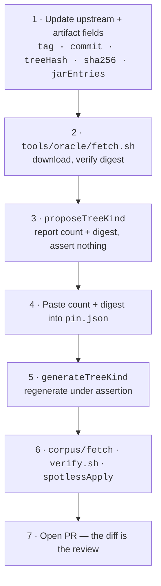

# Flix Pin Bump Workflow and Checklist

The manual procedure for bumping the pinned upstream Flix release in `wstein/flix-spec`.

## Cadence and Policy

- **Pin target**: official upstream release tags (e.g. `v0.75.1`) — never a moving branch ref, an
  unreleased commit, or a fork.
- **Cadence**: bump when upstream publishes a new release tag.
- **Automation**: pin bumps are **never automated and never auto-merged**. A bump requires human
  review of the structural diff.

**Dependabot cannot do this.** The Flix pin is not a package ecosystem, so nothing will notice that
0.75.2 exists. Dependabot covers GitHub Actions and Gradle dependencies only. This asymmetry is
deliberate — do not "fix" the apparent gap by pointing any check at a moving ref.

## Order of operations

The generators assert against `pin.json`, so the file is updated in two passes. Doing this in the
wrong order produces a `FATAL` that names the escape hatch, so the procedure is recoverable rather
than merely documented.



## Checklist

1. **Update the pin's identity fields in `pin.json`**, which are knowable before anything is run:
   - `upstream.tag`, `upstream.commit`, `upstream.treeHash`
   - `oracleArtifact.url`, `.sha256`, `.sizeBytes`, `.jarEntries`, `.attestation`
   - `buildProvenance` if upstream changed build tool, Scala version or JDK target
   - Leave `treeKindCount`, `treeKindDigest`, `tokenKindCount` and `tokenKindDigest` alone for now.

2. **Fetch and verify the oracle artifact:**
   ```sh
   ./tools/oracle/fetch.sh
   ```
   Fails loudly unless the download matches `oracleArtifact.sha256`.

3. **Discover the new TreeKind and TokenKind values:**
   ```sh
   ./gradlew -q :tools:project:proposeTreeKind
   ./gradlew -q :tools:project:proposeTokenKind
   ```
   Reports `treeKindCount`/`treeKindDigest` and `tokenKindCount`/`tokenKindDigest` for the new jar
   without asserting or writing. This step exists because asserting here would be circular — the
   new values cannot be known until the new jar has been read.

4. **Paste all four values into `pin.json`.** This is the point of the two-pass design: the numbers
   enter the repository through a human, in the same commit as the bump.

5. **Regenerate under assertion:**
   ```sh
   ./gradlew :tools:project:generateTreeKind
   ./gradlew :tools:project:generateTokenKind
   ```
   Now that `pin.json` carries the new values, this must succeed. If it does not, the jar and the
   pin disagree and the bump is wrong.

6. **Refresh the corpus and run the full suite:**
   ```sh
   ./corpus/fetch
   ./gradlew spotlessApply
   ./gradlew test
   ./tools/project/verify.sh
   ```
   Update `corpus/corpus.json` counts if upstream added or removed `.flix` files.

7. **Write the PR body.** The diff is the review, so state plainly:
   - upstream release tag and commit range;
   - **TreeKinds added, removed, or re-parented**, and **TokenKinds added or removed**. A removed
     token breaks lexical consumers exactly as a removed kind breaks structural ones. A removed kind or a changed parent is breaking
     Either is breaking for consumers and must be called out explicitly, never left for a reader
     to spot in the diff;
   - fixture output changes and any shift in negative-fixture diagnostic class or line;
   - whether `oracleArtifact.attestation` still reads `digest-only`, or whether upstream has since
     started publishing build attestations.

## Bumping the published Maven version

The pin bump alone moves the published artifact's version automatically: `packaging/build.gradle.kts`
derives the `-flix<version>` suffix from `pin.json.upstream.tag` at build time (see
[`docs/VERSIONING.md`](VERSIONING.md)). Nothing to do there.

What the pin bump does **not** do automatically: if step 7's PR body says a kind was removed or
re-parented (a breaking change for consumers), bump `gradle.properties`' `version` field's major
component by hand, in the same PR. A kind added with no removal is a minor bump; a bump with no
schema change at all (pure content refresh) is a patch bump. `.github/workflows/pages.yml` will
refuse to publish if the resulting full version already exists, so getting this wrong fails loudly
rather than silently overwriting a prior release.

## If the release has no `flix.jar` asset

Use `tools/oracle/build-from-source.sh`. It builds the assembly from a throwaway checkout at the
pinned commit and reports the digest, but deliberately **does not** update `pin.json` — blessing a
self-built artifact as the oracle is a human decision.

Be aware of what that trade costs. At `v0.75.1` a same-commit rebuild was **not** byte-identical to
the published asset (16794 entries versus 16776, most likely transitive-dependency drift), so
building from source is not a reproducibility guarantee against what users actually run. Record
which artifact was chosen, and why, in the PR.
