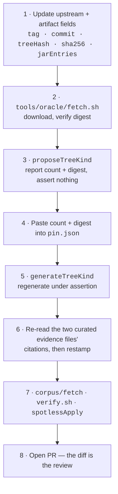

# Flix Pin Bump Workflow and Checklist

The manual procedure for bumping the pinned upstream Flix release in `wstein/flix-spec`.

## Cadence and Policy

- **Pin target**: official upstream release tags (e.g. `v0.75.1`) — never a moving branch ref, an
  unreleased commit, or a fork.
- **Cadence**: bump when upstream publishes a new release tag.
- **Automation**: pin bumps are **never automated and never auto-merged**. A bump requires human
  review of the structural diff.

**Dependabot cannot do this.** The Flix pin is not a package ecosystem, so nothing will notice that
0.75.2 exists. Dependabot covers GitHub Actions and Gradle dependencies only. This asymmetry is
deliberate — do not "fix" the apparent gap by pointing any check at a moving ref.

**What does notice.** `tools/oracle/check-drift.sh`, run weekly by `corpus.yml`, compares the blob
SHAs of the four upstream files that define the vocabularies and the parser's behaviour
(`SyntaxTree.scala`, `TokenKind.scala`, `Parser2.scala`, `Lexer.scala`) against the values recorded
in `pin.json.upstream.vocabularySources`. It reports; it never bumps.

It replaced a release-tag comparison, which was a proxy and failed the way proxies do. Upstream
removed the `Law` TreeKind and the `KeywordLaw`/`KeywordLawful` TokenKinds **on master, without
cutting a release** — so "is there a newer tag?" answered *no* while the vocabulary this repository
is built on had already changed. Watch the thing, not a stand-in for it.

Run it yourself at any time:

```sh
./tools/oracle/check-drift.sh              # against upstream master
./tools/oracle/check-drift.sh --ref=v0.76.0 # against a specific ref
```

## Order of operations

The generators assert against `pin.json`, so the file is updated in two passes. Doing this in the
wrong order produces a `FATAL` that names the escape hatch, so the procedure is recoverable rather
than merely documented.



## Checklist

1. **Update the pin's identity fields in `pin.json`**, which are knowable before anything is run:
   - `upstream.tag`, `upstream.commit`, `upstream.treeHash`
   - `upstream.vocabularySources` — the four blob SHAs at the new commit, so drift detection
     starts measuring from the new baseline. `git rev-parse <commit>:<path>` gives each one.
   - `oracleArtifact.url`, `.sha256`, `.sizeBytes`, `.jarEntries`, `.attestation`
   - `buildProvenance` if upstream changed build tool, Scala version or JDK target
   - Leave `treeKindCount`, `treeKindDigest`, `tokenKindCount` and `tokenKindDigest` alone for now.

2. **Fetch and verify the oracle artifact:**
   ```sh
   ./tools/oracle/fetch.sh
   ```
   Fails loudly unless the download matches `oracleArtifact.sha256`.

3. **Discover the new TreeKind and TokenKind values:**
   ```sh
   ./gradlew -q :tools:project:proposeTreeKind
   ./gradlew -q :tools:project:proposeTokenKind
   ```
   Reports `treeKindCount`/`treeKindDigest` and `tokenKindCount`/`tokenKindDigest` for the new jar
   without asserting or writing. This step exists because asserting here would be circular — the
   new values cannot be known until the new jar has been read.

4. **Paste all four values into `pin.json`.** This is the point of the two-pass design: the numbers
   enter the repository through a human, in the same commit as the bump.

5. **Regenerate under assertion:**
   ```sh
   ./gradlew :tools:project:generateTreeKind
   ./gradlew :tools:project:generateTokenKind
   ```
   Now that `pin.json` carries the new values, this must succeed. If it does not, the jar and the
   pin disagree and the bump is wrong.

6. **Re-verify both curated evidence files.** `ast/unattachable.json` and `ast/transparency.json`
   are the only hand-maintained inputs in this repository, and every entry in each cites upstream
   source *by line*. Line numbers do not survive a pin bump on trust, so both files carry the
   `upstreamCommit` they were read against and `generateStatus` refuses to run while either
   disagrees with `pin.json`:

   ```text
   FATAL: ast/unattachable.json is at upstreamCommit <old>, but pin.json is at <new>.
   FATAL: ast/transparency.json is at upstreamCommit <old>, but pin.json is at <new>.
   ```

   **`ast/unattachable.json`** — re-read each citation at the new commit and confirm the argument
   still holds. A kind can become constructible, or a dead store can be fixed upstream, and either
   would silently turn a `structurally-unattachable` verdict into a lie. Then restamp
   `upstreamCommit`.

   Two outcomes are worth expecting rather than treating as surprises:
   - **An entry no longer holds.** Delete it. If the kind is genuinely reachable now, the next
     `verify.sh` will classify it `corpus-only` or `unknown`, which is the honest result and a
     fixture to write, not a regression to suppress.
   - **A new kind appears with no evidence either way.** Leave it `unknown`. `generateStatus`
     reports unknowns but does not fail on them, precisely so that nobody is pressured into
     inventing an unargued entry to get a green build.

   **`ast/transparency.json`** — the same treatment, and it is the one with teeth, because every
   entry changes the shape of `fixtures/expected` and therefore of every consumer's score. Re-read
   each citation and confirm the arity claim still holds at the new commit: an `elide` entry asserts
   the node contributes one edge and no leaf content, and a production that gains a second child or a
   token of its own falsifies it.

   `./gradlew :tools:project:proposeTransparency` reports the measured candidate set and flags any
   committed rule the fixtures now contradict — run it after regenerating fixtures, and read both
   directions of its output:
   - **`CONTRADICTED`** means a committed rule is now wrong. Remove it, or narrow it, and expect
     `fixtures/expected` to change.
   - **`NOT IN CONTRACT`** means a kind now behaves like a wrapper. That is a *candidate*, never a
     conclusion: adding it needs an argument from the reference's own structure and citations a
     reader can check. A reason of the form "consumer X does not produce one" is rejected by the
     checker and by a test, and for good reason — with one instrumented consumer, nothing else could
     tell a neutral rule from one shaped by that consumer.

   A change here is **breaking for consumers**, because the canonical trees they compare against
   change shape. Call it out explicitly in the PR body (step 8).

7. **Refresh the corpus and run the full suite:**
   ```sh
   ./corpus/fetch
   ./gradlew spotlessApply
   ./gradlew test
   ./tools/project/verify.sh
   ./gradlew :tools:project:reachability   # needs the corpus; also refreshes ast/status.json
   ./gradlew :tools:project:generateStatus
   ./gradlew :tools:project:generateDocs   # rewrites the generated counts in README/CONFORMANCE
   ```
   Update `corpus/corpus.json` counts if upstream added or removed `.flix` files.

8. **Write the PR body.** The diff is the review, so state plainly:
   - upstream release tag and commit range;
   - **TreeKinds added, removed, or re-parented**, and **TokenKinds added or removed**. A removed
     token breaks lexical consumers exactly as a removed kind breaks structural ones, and a changed
     parent breaks the qualified name. Each is breaking for consumers and must be called out
     explicitly, never left for a reader to spot in the diff;
   - **any movement in `ast/status.json`** — a kind leaving `structurally-unattachable`, or arriving
     as `unknown`, or changing `treeKindRole`, is a statement about the reference compiler and
     deserves a sentence rather than a line in a generated file;
   - **any change to `ast/transparency.json`**, which changes the shape of the canonical trees every
     consumer compares against. State the rule added or removed and its measured effect on
     `checkNormalization`'s node-removal figure;
   - fixture output changes and any shift in negative-fixture diagnostic class or line;
   - whether `oracleArtifact.attestation` still reads `digest-only`, or whether upstream has since
     started publishing build attestations.

## Bumping the published Maven version

The pin bump alone moves the published artifact's version automatically: `packaging/build.gradle.kts`
derives the `-flix<version>` suffix from `pin.json.upstream.tag` at build time (see
[`docs/VERSIONING.md`](VERSIONING.md)). Nothing to do there.

What the pin bump does **not** do automatically: if step 7's PR body says a kind was removed or
re-parented (a breaking change for consumers), bump `gradle.properties`' `version` field's major
component by hand, in the same PR. A kind added with no removal is a minor bump; a bump with no
schema change at all (pure content refresh) is a patch bump. `.github/workflows/pages.yml` will
refuse to publish if the resulting full version already exists, so getting this wrong fails loudly
rather than silently overwriting a prior release.

## If the release has no `flix.jar` asset

Use `tools/oracle/build-from-source.sh`. It builds the assembly from a throwaway checkout at the
pinned commit and reports the digest, but deliberately **does not** update `pin.json` — blessing a
self-built artifact as the oracle is a human decision.

Be aware of what that trade costs. At `v0.75.1` a same-commit rebuild was **not** byte-identical to
the published asset (16794 entries versus 16776, most likely transitive-dependency drift), so
building from source is not a reproducibility guarantee against what users actually run. Record
which artifact was chosen, and why, in the PR.
