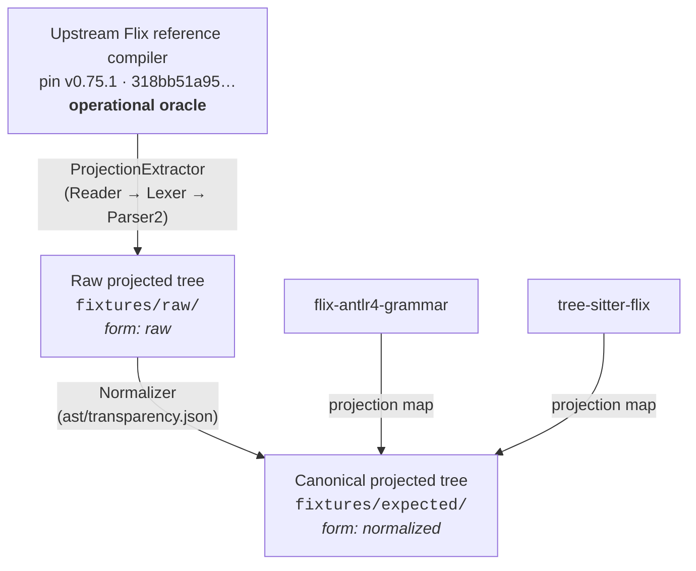

# Flix Projection Specification and Conformance Contract

This document defines the canonical projected syntax tree format, normalization rules, and conformance contract for `wstein/flix-spec`.

## 1. Overview

`flix-spec` provides shared test infrastructure for independent parsers of the Flix programming
language, such as `flix-antlr4-grammar`, `tree-sitter-flix` and `flix-textmate`.

Rather than comparing raw string sequences or implementation-specific AST representations,
consumers project their parse trees into a **canonical projected tree** defined by
`schemas/projection.schema.json`.



The arrows into the canonical tree run in one direction only. The reference compiler defines the
shape; consumers map onto it. No consumer is an authority over another, and none is an authority
over the reference.

## 2. Canonical Projected Tree Format

A projected syntax tree document represents one or more compilation units. Each compilation unit contains:
- `source`: The relative virtual path or filename of the source file.
- `tree`: A recursive node hierarchy representing the concrete syntax tree.

Every document also declares its **`form`**, and this repository commits both:

| Form | Where | What it is |
| --- | --- | --- |
| `raw` | `fixtures/raw/` | Exactly what the reference parser produced, node for node. |
| `normalized` | `fixtures/expected/` | That tree with `ast/transparency.json` applied — §2.3. |

A consumer emits `raw`: its own tree, its own wrappers, its own error-recovery nodes intact. The
conformance comparison applies that consumer's declared transparency rules itself, and it needs the
unreduced tree because two of its three lanes reduce it differently.

A projected tree whose shape depends on an unstated normalisation is not comparable to anything,
which is why `form` is required rather than inferred from a directory name.

### 2.1 Node Structure

A projected tree node consists of:
- `kind`: A qualified syntax tree node kind string, drawn directly from `ast/treekind.json` (e.g. `Expr.Apply`, `Decl.Def`, `Type.Tuple`, `ErrorTree`).

  Qualification is mandatory, not cosmetic. `SyntaxTree.TreeKind` has no `toString` override, so
  13 simple names are reused across sub-traits — `Expr.Apply` and `Type.Apply` both print as
  `"Apply"`, and 28 leaf positions collapse to 13 bare strings. A bare name cannot identify a node
  kind. Qualified names are derived from the **type hierarchy**, not from lexical nesting: the two
  disagree for `DerivationList`, which is declared at `TreeKind` top level but extends `Type`, and
  is therefore `Type.DerivationList`.
- `children`: An ordered list of child elements. A child may be a sub-node or a leaf token.
- `span` *(advisory)*: Source position span `{"start": {"line": L, "col": C}, "end": {"line": L, "col": C}}`.

### 2.2 Token Node Structure

A leaf token node consists of:
- `token`: The lexer token kind name (e.g. `Ident`, `KeywordDef`, `Err`).
- `text`: The exact character text matching the token.
- `start` / `end`: 1-indexed source positions `{"line": L, "col": C}`.

### 2.3 Normalisation: the canonical form

The reference's tree is not the canonical tree. Some of what it contains is an artifact of how *that*
parser is written rather than a fact about Flix syntax, and asking every consumer to reproduce it
would measure resemblance to one implementation instead of agreement about structure.

`ast/transparency.json` names exactly what is removed, under two rules:

| Rule | Removes | At what arity |
| --- | --- | --- |
| `elide` | wrapper nodes that carry no information beyond their child | dropped when empty, replaced by their child when singular, **kept** at two or more |
| `splice` | the error-recovery vocabulary (`ErrorTree`, `OperatorError`, `TrailingDot`) | children lifted into the parent, at any arity |

Twelve `elide` rules and three `splice` rules remove **718 of 4228 nodes (17.0%)** at this pin.

Three properties make the rules trustworthy rather than convenient:

- **Neutrality is argued from the reference's own structure.** Every entry cites the `Parser2` sites
  that close the kind and explains why the node contributes one edge and no leaf content. A reason of
  the form *"parser X does not produce one"* is rejected by the checker and by a test. This
  repository instruments a single consumer, so no measurement here could tell a neutral rule from one
  shaped by that consumer — the reasons are the only evidence there is, and evidence about a consumer
  is not evidence about the reference.
- **Measurement can refute a rule.** An `elide` entry claims the node never holds more than one child
  and never holds a token. A fixture containing a counter-example fails the build.
- **Nodes are removed; leaves never are.** A wrapper's child takes its position, an error marker's
  children take its place. Token text is therefore invariant under normalisation, and `lossless`
  asserts that over both committed forms rather than asserting it in prose.

`./gradlew :tools:project:proposeTransparency` reports candidates by measurement — kinds whose every
occurrence has at most one child and never a token child — and never writes. A human writes the
argument. The candidate rule deliberately differs from `ast/coverage.json`'s
`alwaysSingleChildWrapper` in both halves: *exactly* one child misses every routinely-empty wrapper
(`Doc` is the second largest in the suite), and ignoring token children would propose `Ident`,
`Expr.Literal` and `Type.Variable`, which hold one token and give it its role.

`UnclosedMark` is deliberately **not** here. The parser always overwrites it, so it can appear in no
tree from any input; it is argued in `ast/unattachable.json` instead, and the checker refuses an
entry claiming both. A normalisation rule for a node that never occurs would be unfalsifiable.

Consumers do not apply these rules — `fixtures/expected` already has them applied. What a consumer
declares is the *mirror*: which of its own nodes are transparent, and which of its own nodes are
recovery markers. See [`CONFORMANCE.md`](CONFORMANCE.md).

## 3. Load-bearing vs. Normalised Elements

To enable meaningful cross-parser comparison, projected trees distinguish between load-bearing structural elements and normalized presentation details:

| Element | Status | Rule |
| --- | --- | --- |
| **Node Kind** | Mandatory | Must match the qualified `TreeKind` name in `ast/treekind.json`. |
| **Child Order** | Mandatory | Child sequence order must match reference output exactly. |
| **Nesting Structure** | Mandatory | Parent-child parentheticals and block nestings must match. |
| **Source Spans** | Advisory | Line/column positions are recorded for diagnostics but not strictly gated for structural agreement. |
| **Whitespace / Comments** | Normalised | Whitespace and comment tokens are stripped from non-lexical comparisons unless explicitly under test in lexical fixtures. |
| **Wrapper Nodes** | Normalised | Removed from the canonical tree per `ast/transparency.json` (§2.3), so they are never compared. |
| **Error Recovery** | Separately gated | The error vocabulary is spliced out of the canonical tree and measured in its own conformance lane against `fixtures/raw/`. Diagnostics still gate on class and line number (§3.4). |

## 4. Consumer Projection Maps

External parsers use different naming conventions — `tree-sitter-flix`, for example, has 190 named
`snake_case` node types. Its near-match to the 192 `TreeKind`s is a coincidence, not a
correspondence, so expect a genuine mapping effort rather than a rename table.

Each consumer maintains a projection map **in its own repository** — conventionally
`conformance/projection-map.json` — mapping its native AST node vocabulary into the canonical
`TreeKind` names defined in `ast/treekind.json`. The map encodes facts about that consumer's grammar
shape, not about the reference, so it belongs beside that grammar. `flix-spec` owns only the schema
(`schemas/projection-map.schema.json`), the canonical vocabulary, and the comparison; validate a map
with `./gradlew :tools:project:validateProjectionMap --args='<path>'`.

Example projection map entry (`tree-sitter-flix`'s `conformance/projection-map.json`):
```json
{
  "schemaVersion": 1,
  "consumer": "tree-sitter-flix",
  "mappings": {
    "function_definition": "Decl.Def",
    "call_expression": "Expr.Apply",
    "binary_expression": "Expr.Binary",
    "ERROR": "ErrorTree"
  },
  "recoveryMarkers": ["ERROR"]
}
```

`elide` and `flattenCanonical` — which named *canonical* kinds to skip — are **deprecated**. That
work now happens once, upstream, in `ast/transparency.json`, where it can be argued from the
reference's own structure rather than re-derived per consumer with each one's grammar shape leaking
into it. What remains admissible there is a consumer-specific extra: a canonical kind that consumer
genuinely cannot produce but that is not transparent in the reference.

`recoveryMarkers` is the one thing a consumer must still declare about the reference's vocabulary,
and it is really a declaration about its own: which of its nodes mark error recovery. It is
deliberately not `flatten` — see [`CONFORMANCE.md`](CONFORMANCE.md), "The three lanes".

## 5. Schema Versioning

All generated artifacts carry an explicit `schemaVersion` field.

- `schemaVersion` increments independently of Flix compiler release pin updates whenever that
  artifact's schema or structural contracts change.
- It is **per artifact**, not global: a projected tree at version `2` and an `ast/coverage.json` at
  version `2` are not in agreement about anything, they are two contracts moving at their own pace. A
  consumer asserts the version of each artifact it actually reads.
- Projected trees (`schemas/projection.schema.json`) are at version `2`: `form` became required, and
  the tree in `fixtures/expected/` became the normalised one. A reader that gated on version `1` was
  reading documents with no normalisation applied at all, so failing loudly is the intended outcome.
- Conformance reports (`schemas/conformance-report.schema.json`) are at version `6`: a third lane,
  and a `fixtureRevision` that covers both committed forms.
- `ast/status.json` is at version `2`: it gained `treeKindRole`.
