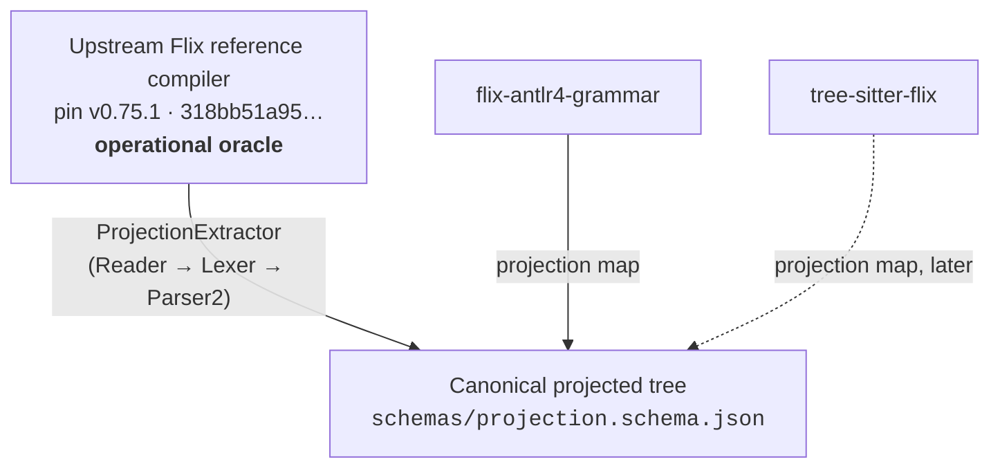

# Flix Projection Specification and Conformance Contract

This document defines the canonical projected syntax tree format, normalization rules, and conformance contract for `wstein/flix-spec`.

## 1. Overview

`flix-spec` provides shared test infrastructure for independent parsers of the Flix programming
language, such as `flix-antlr4-grammar`, `tree-sitter-flix` and `flix-textmate`.

Rather than comparing raw string sequences or implementation-specific AST representations,
consumers project their parse trees into a **canonical projected tree** defined by
`schemas/projection.schema.json`.



The arrows into the canonical tree run in one direction only. The reference compiler defines the
shape; consumers map onto it. No consumer is an authority over another, and none is an authority
over the reference.

## 2. Canonical Projected Tree Format

A projected syntax tree document represents one or more compilation units. Each compilation unit contains:
- `source`: The relative virtual path or filename of the source file.
- `tree`: A recursive node hierarchy representing the concrete syntax tree.

### 2.1 Node Structure

A projected tree node consists of:
- `kind`: A qualified syntax tree node kind string, drawn directly from `ast/treekind.json` (e.g. `Expr.Apply`, `Decl.Def`, `Type.Tuple`, `ErrorTree`).

  Qualification is mandatory, not cosmetic. `SyntaxTree.TreeKind` has no `toString` override, so
  13 simple names are reused across sub-traits — `Expr.Apply` and `Type.Apply` both print as
  `"Apply"`, and 28 leaf positions collapse to 13 bare strings. A bare name cannot identify a node
  kind. Qualified names are derived from the **type hierarchy**, not from lexical nesting: the two
  disagree for `DerivationList`, which is declared at `TreeKind` top level but extends `Type`, and
  is therefore `Type.DerivationList`.
- `children`: An ordered list of child elements. A child may be a sub-node or a leaf token.
- `span` *(advisory)*: Source position span `{"start": {"line": L, "col": C}, "end": {"line": L, "col": C}}`.

### 2.2 Token Node Structure

A leaf token node consists of:
- `token`: The lexer token kind name (e.g. `Ident`, `KeywordDef`, `Err`).
- `text`: The exact character text matching the token.
- `start` / `end`: 1-indexed source positions `{"line": L, "col": C}`.

## 3. Load-bearing vs. Normalised Elements

To enable meaningful cross-parser comparison, projected trees distinguish between load-bearing structural elements and normalized presentation details:

| Element | Status | Rule |
| --- | --- | --- |
| **Node Kind** | Mandatory | Must match the qualified `TreeKind` name in `ast/treekind.json`. |
| **Child Order** | Mandatory | Child sequence order must match reference output exactly. |
| **Nesting Structure** | Mandatory | Parent-child parentheticals and block nestings must match. |
| **Source Spans** | Advisory | Line/column positions are recorded for diagnostics but not strictly gated for structural agreement. |
| **Whitespace / Comments** | Normalised | Whitespace and comment tokens are stripped from non-lexical comparisons unless explicitly under test in lexical fixtures. |
| **Error Recovery** | Advisory | Error recovery diagnostics and `ErrorTree` positions line-gate on class and line number (§3.4). |

## 4. Consumer Projection Maps

External parsers use different naming conventions — `tree-sitter-flix`, for example, has 190 named
`snake_case` node types. Its near-match to the 192 `TreeKind`s is a coincidence, not a
correspondence, so expect a genuine mapping effort rather than a rename table.

Each consumer maintains a projection map **in its own repository** — conventionally
`conformance/projection-map.json` — mapping its native AST node vocabulary into the canonical
`TreeKind` names defined in `ast/treekind.json`. The map encodes facts about that consumer's grammar
shape, not about the reference, so it belongs beside that grammar. `flix-spec` owns only the schema
(`schemas/projection-map.schema.json`), the canonical vocabulary, and the comparison; validate a map
with `./gradlew :tools:project:validateProjectionMap --args='<path>'`.

Example projection map entry (`tree-sitter-flix`'s `conformance/projection-map.json`):
```json
{
  "schemaVersion": 1,
  "consumer": "tree-sitter-flix",
  "mappings": {
    "function_definition": "Decl.Def",
    "call_expression": "Expr.Apply",
    "binary_expression": "Expr.Binary"
  }
}
```

## 5. Schema Versioning

All generated artifacts carry an explicit `schemaVersion` field.

- `schemaVersion` increments independently of Flix compiler release pin updates whenever that
  artifact's schema or structural contracts change.
- It is **per artifact**, not global: a projected tree at version `1` and an `ast/coverage.json` at
  version `2` are not in disagreement, they are two contracts moving at their own pace. A consumer
  asserts the version of each artifact it actually reads.
- Canonical projected trees (`schemas/projection.schema.json`) are at version `1`.
